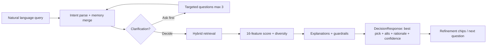
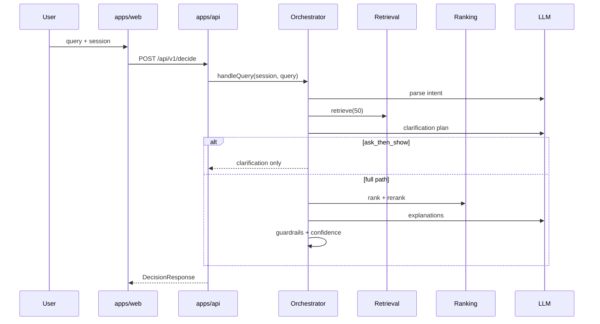
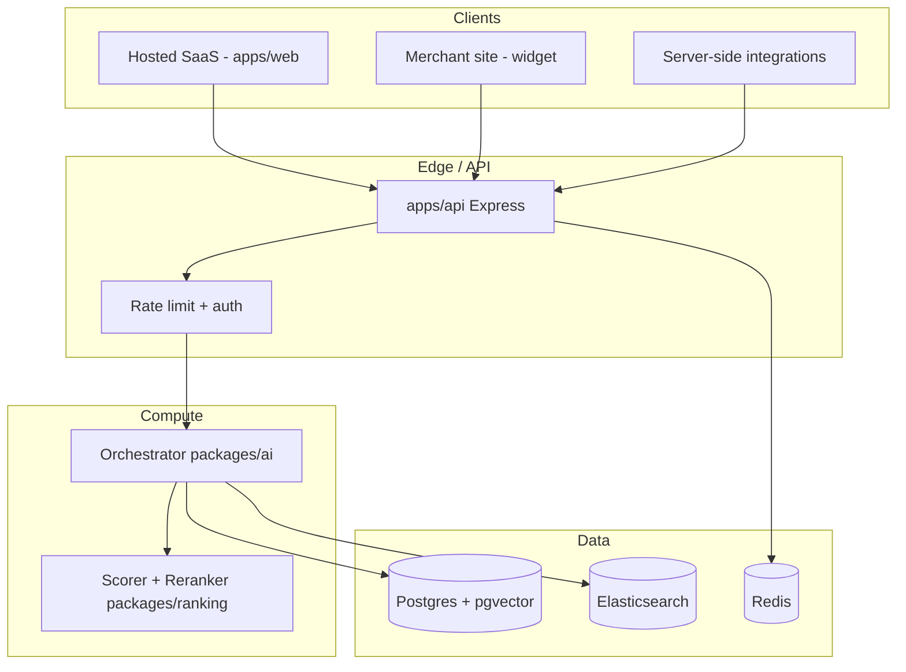
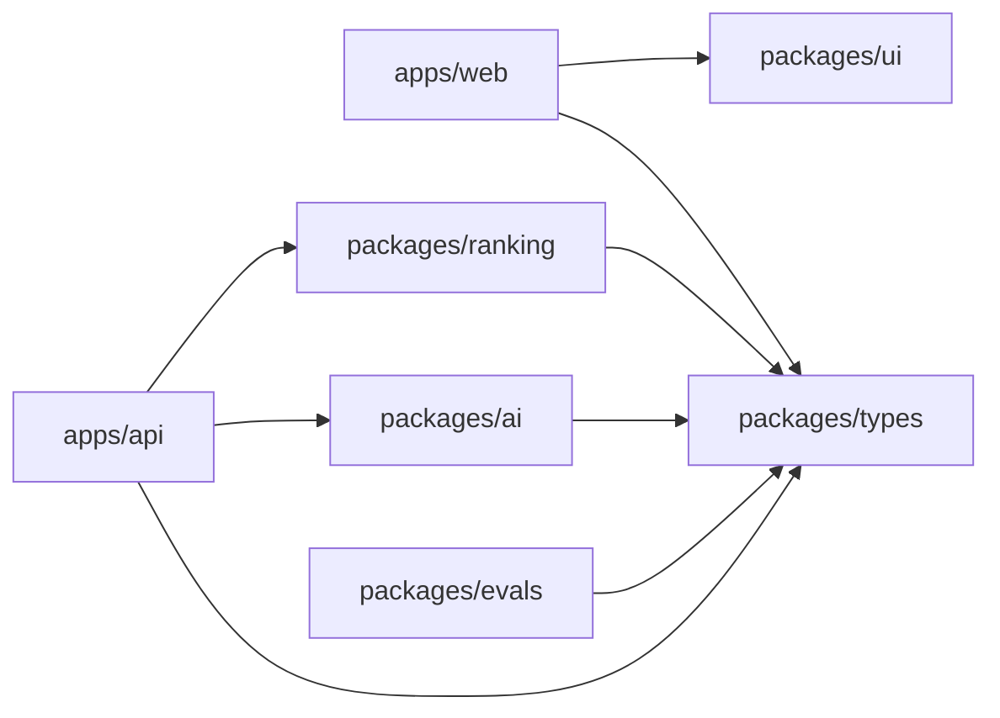
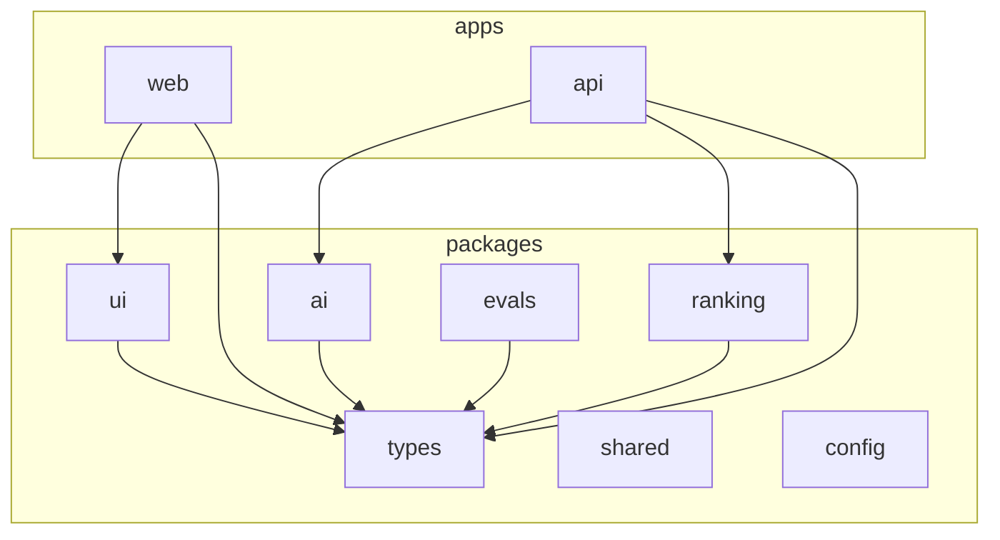

# Discovery Copilot — Complete Architecture Document

**Version:** 1.0 · **Last updated:** 2026-03-30 · **Repository root:** `discovery-copilot/`

This document is the authoritative technical specification for **Discovery Copilot**, an AI-powered **e-commerce decision engine** (not a conventional search box). It converts vague shopping intent into **ranked, explainable product decisions**: a **best pick**, **alternatives**, **rationale**, and **confidence**, grounded in catalog, reviews, and return intelligence.

---

## 1. Executive Summary

Discovery Copilot sits between **natural-language intent** and **merchant catalog reality**. Unlike keyword search, it:

- **Decides**, not merely retrieves: every response is framed as a **decision** with tradeoffs, not a flat list of hits.
- Runs a **multi-stage pipeline** (13 stages, see §4) instead of a single LLM prompt, separating **parsing**, **retrieval**, **ranking**, **explanation**, and **guardrails**.
- Optimizes for **customer outcomes** (fit, satisfaction, return risk) via **16-feature weighted ranking** with **diversity constraints** (brand caps, subcategory caps, MMR-style selection in `packages/ranking`).
- Supports **two commercial modes** from architecture day one: **API / embedded** (merchant backend + widget) and **hosted SaaS** (Discovery Copilot–operated web app), both backed by the same **multi-tenant** core (API keys, catalog sync, branding).
- Defaults to **GPT-4o-mini** via a **provider-agnostic** LLM abstraction (`packages/ai/src/llm-provider.ts`), enabling swap-in of other models without changing orchestration contracts.

**Primary code locations:**

| Concern | Location |
|--------|----------|
| Monorepo orchestration | `turbo.json`, root `package.json` |
| Web app (Next.js) | `apps/web/` |
| API (Express + TypeScript) | `apps/api/` |
| Shared types & API contracts | `packages/types/` |
| LLM orchestration, prompts, guardrails | `packages/ai/` |
| Scoring, reranking, confidence | `packages/ranking/` |
| Design tokens & UI primitives | `packages/ui/` |
| Evaluation dataset & 32 test cases | `packages/evals/` |
| Shared config / logging | `packages/config/`, `packages/shared/` |

**North-star outcome:** Shoppers complete purchases with **higher confidence and lower regret**; merchants see **measurable lift** in conversion and **reduction** in category-appropriate returns—without sacrificing **tenant isolation** or **auditability** of each recommendation.

---

## 2. Product Definition

### 2.1 What Discovery Copilot Is

- **Decision engine:** Outputs a structured **`DecisionResponse`** (`packages/types/src/decision.ts`) with `decision.bestPick`, `decision.alternatives`, `decision.rationale`, and `confidence` (plus `parsedIntent`, optional `clarification`, `suggestedRefinements`, `metadata`).
- **Conversation-aware:** Maintains **`Session`** and **`ConversationTurn`** records (`packages/types/src/session.ts`) so follow-ups (“cheaper,” “the second one”) merge with prior constraints.
- **Clarification-smart:** Uses a **6-factor weighted framework** (`packages/ai/src/clarification-planner.ts`) to decide whether to ask questions first, show results with refinement chips, or ask-then-show.

### 2.2 What It Is Not

- Not a replacement for **PCI**, **payments**, or **OMS**—it recommends; checkout stays on the merchant.
- Not **unbounded agent shopping**—tool use is bounded to **retrieval**, **memory**, **review snippets**, and **structured explanation** generation.
- Not **single-tenant**—`MerchantTenant` (`packages/types/src/tenant.ts`) is the isolation primitive from day one.

### 2.3 Business Models

| Mode | Buyer | Surface | Billing hook |
|------|--------|---------|----------------|
| **API / embedded** | B2B merchant | REST/GraphQL + JS widget on merchant domain | Per-call / tiered quota + optional outcome fee |
| **Hosted SaaS** | Merchant or agency | `apps/web` on Discovery Copilot infra | Seat + GMV-adjacent tier |

Both modes share **`MerchantTenant`**, **`CatalogConfig`**, **`SearchConfig`**, **`BrandingConfig`**, and **`ApiKeyRecord`**.

### 2.4 Success Criteria (Product)

1. **Decision quality:** Best pick is **defensible** from catalog + review evidence (not LLM invention).
2. **Latency:** P95 **&lt; 3s** for full decision path (see `TC-015` in `packages/evals/src/test-cases.ts`).
3. **Trust:** Guardrails block **hallucinated specs**, **price mismatches**, and **disallowed claims** (`packages/ai/src/guardrails.ts`).
4. **Operator control:** Per-tenant **ranking overrides**, **blocked categories**, **boosted categories** (`SearchConfig`).

---

## 3. Core User Experience

### 3.1 Primary Journey



### 3.2 UX Primitives (Hosted + Embeddable)

| Primitive | Purpose | Implementation touchpoint |
|-----------|---------|---------------------------|
| **Best pick hero** | Single authoritative recommendation | `apps/web/src/components/BestPickCard.tsx`, `DecisionRationale.tsx` |
| **Alternatives rail** | Comparable options with different tradeoffs | `AlternativeCard.tsx`, `RecommendationPanel.tsx` |
| **Inline clarification** | Questions without leaving context | `ClarificationInline.tsx` |
| **Refinement chips** | Fast constraint edits | `RefinementChips.tsx` |
| **Loading / trust** | Perceived performance | `SearchSkeleton.tsx` |

### 3.3 Emotional Design Goal

The UI should feel like a **confident specialist**, not a chat toy: **one primary decision**, **evidence visible on demand**, **uncertainty explicit** (`confidence.recommendation`).

---

## 4. Decision Engine Design

### 4.1 Thirteen-Stage Decision Pipeline

The engine is **not** “one prompt.” Stages map to modules under `packages/ai` and `packages/ranking`, with persistence and infra at `apps/api`.

| Stage | Name | Responsibility | Primary module(s) |
|-------|------|----------------|---------------------|
| 1 | **Tenant & auth context** | Resolve `tenantId`, API key, `SearchConfig` / branding | `apps/api` middleware, `packages/types/tenant` |
| 2 | **Session load** | Load or create `Session`, attach `locale`, currency | `apps/api/src/routes/session.ts` |
| 3 | **Long-term memory** | Optional `LongTermMemory` for logged-in users | `packages/ai` orchestrator + `apps/api/src/services/memory.ts` |
| 4 | **Intent parsing** | NL → `ParsedIntent` (constraints, use cases, ambiguity) | `packages/ai/src/intent-parser.ts`, `prompts/intent.ts` |
| 5 | **Candidate retrieval** | Hybrid lexical + vector + filters, ~50 candidates | `apps/api/src/services/retrieval.ts` |
| 6 | **Clarification planning** | 6-factor score → strategy + questions | `packages/ai/src/clarification-planner.ts` |
| 7 | **Branch** | `ask_then_show` short-circuit vs full rank | `packages/ai/src/orchestrator.ts` |
| 8 | **Feature extraction** | 16 features per SKU | `packages/ranking/src/features.ts` |
| 9 | **Weighted scoring** | Weighted sum → `CompositeScore` | `packages/ranking/src/scorer.ts` |
| 10 | **Diversity rerank** | Brand/subcategory caps, backfill | `packages/ranking/src/reranker.ts` |
| 11 | **Explanation generation** | Per-candidate JSON explanations from evidence | `packages/ai/src/orchestrator.ts`, `prompts/explanation.ts` |
| 12 | **Guardrails** | Strip unsafe/invalid claims | `packages/ai/src/guardrails.ts` |
| 13 | **Confidence + response assembly** | `ConfidenceScore` + `DecisionResponse` / `SubmitQueryResponse` | `orchestrator.ts`, `packages/types` |



### 4.2 Decision Output Contract

The canonical **`DecisionResponse`** shape (abbreviated):

```typescript
// packages/types/src/decision.ts — conceptual excerpt
interface DecisionResponse {
  id: string;
  sessionId: string;
  query: string;
  decision: {
    bestPick: RecommendationCard;
    alternatives: RecommendationCard[];
    rationale: string;
    tradeoffSummary: string;
    missingInformation: string[];
    coverageNote?: string;
  };
  confidence: ConfidenceScore;
  parsedIntent: ParsedIntent;
  clarification?: ClarificationQuestion[];
  suggestedRefinements: string[];
  metadata: DecisionMetadata;
}
```

**`RecommendationCard`** ties **merchandising** (`price`, `imageUrl`, `badges`) to **reasoning** (`reasons[]`, `tradeoffs[]`, `evidence[]`, `returnRisk`).

### 4.3 Ranking: Sixteen Features

`RankingFeatures` (`packages/types/src/ranking.ts`) aligns with `extractFeatures` in `packages/ranking/src/features.ts`:

| # | Feature key | Role |
|---|-------------|------|
| 1 | `lexicalRelevance` | BM25-style term overlap |
| 2 | `semanticRelevance` | Embedding similarity (intent vs product) |
| 3 | `taxonomyFit` | Category breadcrumb vs `categoryHints` |
| 4 | `useCaseFit` | Use-case tags / description |
| 5 | `reviewSentiment` | Star + theme match |
| 6 | `reviewVolume` | Log-scaled review count |
| 7 | `returnRisk` | Inverted return rate, fit sensitivity |
| 8 | `priceFit` | Budget fit + “sweet spot” utilization |
| 9 | `brandAffinity` | Memory / disliked brands |
| 10 | `availability` | Stock, quantity, backorder |
| 11 | `popularity` | Proxy from reviews/sales |
| 12 | `conversionPrior` | Historical or heuristic prior |
| 13 | `recency` | Freshness of listing |
| 14 | `diversityPenalty` | Applied in rerank pass |
| 15 | `noveltyBonus` | Unseen product preference |
| 16 | `businessRuleBoost` | Tenant boosts / pinned campaigns |

**Default weights** (sum ≈ 1.0) live in `packages/ranking/src/scorer.ts` — e.g. `semanticRelevance: 0.18`, `useCaseFit: 0.16`, `taxonomyFit: 0.10`, `priceFit: 0.10`, `reviewSentiment: 0.10`, `returnRisk: 0.08`, `lexicalRelevance: 0.08`, etc.

### 4.4 Diversity Constraints

`ProductReranker` (`packages/ranking/src/reranker.ts`) enforces:

```typescript
const DEFAULT_DIVERSITY: DiversityConstraints = {
  maxSameBrand: 2,
  maxSameSubcategory: 3,
  minPriceSpread: 0.2,
  requireDifferentStyles: true,
  diversityWeight: 0.15,
};
```

Selection is **greedy** with **brand** and **L2 subcategory** caps; **backfill** restores list size if filters are too aggressive—mirrors test case **TC-027** (`packages/evals`).

---

## 5. System Architecture

### 5.1 Logical Architecture



### 5.2 Technology Stack

| Layer | Choice | Notes |
|-------|--------|-------|
| Monorepo | **Turborepo** | `turbo.json` tasks: `build`, `dev`, `lint`, `test`, `typecheck` |
| Frontend | **Next.js + Tailwind + Framer Motion** | App Router under `apps/web/` |
| API | **Express + TypeScript** | Route modules in `apps/api/src/routes/` |
| DB | **Postgres** | Tenants, sessions, products, embeddings metadata |
| Vectors | **pgvector** | Product + intent embeddings; ANN indexes per tenant |
| Cache | **Redis** | Session cache, rate limits, hot catalog slices |
| Lexical | **Elasticsearch** | BM25 on name, description, attributes |
| LLM | **Provider-agnostic**; default **GPT-4o-mini** | `LLMProvider` interface |

### 5.3 Service Boundaries

| Service | Responsibility |
|---------|----------------|
| **apps/api** | HTTP, auth, validation (Zod), wiring orchestrator deps |
| **packages/ai** | Intent, clarification, explanations, guardrails |
| **packages/ranking** | Features, scoring, reranking, confidence helpers |
| **packages/types** | **Single source of truth** for DTOs |
| **packages/ui** | Tokens + headless components for consistent embed + hosted |

### 5.4 Async & Background Work

- **Catalog sync:** Webhook or polling from `CatalogConfig.feedUrl`; workers upsert **Postgres**, reindex **Elasticsearch**, refresh **embeddings** in **pgvector**.
- **Memory update:** `MemoryService.updateFromSession` post-response (non-blocking path preferred).
- **Eval runs:** `packages/evals` batch jobs write metrics to analytics store (Phase 2).

---

## 6. API and Hosted Product Design

### 6.1 Core REST Contract

**`POST /api/v1/decide`** (`apps/api/src/routes/decision.ts`) — primary **decision** endpoint.

**Headers:**

| Header | Required | Purpose |
|--------|----------|---------|
| `x-tenant-id` | Yes (prod) | Tenant isolation |
| `Authorization` / `x-api-key` | Yes | Hashed key lookup in `ApiKeyRecord` |

**Body (Zod):**

```typescript
const decisionRequestSchema = z.object({
  query: z.string().min(1).max(500),
  sessionId: z.string().optional(),
  userId: z.string().optional(),
  context: z.object({
    locale: z.string().default('en-US'),
    currency: z.string().default('USD'),
    device: z.enum(['desktop', 'mobile', 'tablet']).default('desktop'),
  }).optional(),
});
```

### 6.2 API / Embedded Mode

- **Merchant backend** calls `/api/v1/decide` server-to-server (keys never exposed to browser).
- **Embedded widget** loads signed **short-lived token** or **public publishable key** with **domain allowlist** (Phase 1b); still sends `x-tenant-id`.
- **Webhook callbacks** (`WebhookConfig`) for `catalog.sync.completed`, `recommendation.generated`, etc.

### 6.3 Hosted SaaS Mode

- **`apps/web`** provides full **search page** (`apps/web/src/app/search/page.tsx`), marketing home (`app/page.tsx`), shared layout (`app/layout.tsx`).
- **Tenant branding** overlays `BrandingConfig` onto `packages/ui` tokens (CSS variables or runtime theme object).
- **Multi-tenant routing:** Subdomain or path-based `slug` → resolve `MerchantTenant`.

### 6.4 Example JSON Response Fragment

```json
{
  "id": "dec_019f3c2a-4d8b-7e91-a1b2-c3d4e5f60789",
  "sessionId": "sess_8a72…",
  "query": "quiet vacuum for hardwood and a small apartment",
  "decision": {
    "bestPick": {
      "productId": "vac_4421",
      "productName": "AirSilent Pro Compact",
      "brand": "QuietHome",
      "price": { "amount": 279, "currency": "USD" },
      "headline": "Lowest dB in class for hard floors; verified quiet in 200+ reviews",
      "reasons": [
        { "text": "Listed 62 dB in normal mode — matches quiet requirement", "source": "specs", "strength": "strong" }
      ],
      "tradeoffs": [
        { "text": "Smaller dustbin — empty more often", "severity": "minor", "attribute": "capacity" }
      ],
      "badges": [
        { "type": "quiet", "label": "Quiet", "tooltip": "Noise scores in bottom quartile" }
      ],
      "returnRisk": { "level": "low", "percentage": 6 },
      "matchScore": 0.89,
      "evidence": [
        { "type": "review_snippet", "text": "Finally a vacuum I can run at night", "source": "reviews", "confidence": 0.92 }
      ]
    },
    "alternatives": [],
    "rationale": "Selected for acoustic performance on hard surfaces…",
    "tradeoffSummary": "Best pick trades bin size for noise performance…",
    "missingInformation": []
  },
  "confidence": {
    "overall": 0.78,
    "catalogCoverage": 0.9,
    "intentClarity": 0.72,
    "attributeMatchRate": 0.81,
    "reviewSupport": 0.85,
    "uncertaintyFactors": [],
    "recommendation": "moderate_needs_refinement"
  },
  "metadata": {
    "latencyMs": 1842,
    "modelUsed": "gpt-4o-mini",
    "tokensUsed": 4200,
    "candidatesEvaluated": 47,
    "retrievalStrategy": "hybrid_rrf",
    "rankingVersion": "rank_v1.3.0",
    "tenantId": "tenant_acme"
  }
}
```

---

## 7. Integration Strategy

### 7.1 Merchant Data Plane

| Integration | Purpose |
|-------------|---------|
| **Product feed** | `CatalogConfig.feedFormat`: JSON, CSV, XML, Shopify, BigCommerce, Magento |
| **Inventory** | Real-time or daily; drives `availability` feature |
| **Reviews** | Bulk or API; feeds `review-intelligence` service |
| **Returns** | Aggregate return rates by SKU/category |

### 7.2 Integration Tiers

`MerchantTenant.integrationTier`: **basic** (feed-only) → **intermediate** (+ webhooks) → **advanced** (+ real-time inventory + SSO for hosted).

### 7.3 Idempotency & Versioning

- **Catalog documents** carry `contentHash` per SKU; upserts skip unchanged rows.
- **API versioning:** `/api/v1/*` stable; breaking changes bump v2 with overlap window.

### 7.4 Developer Experience

- OpenAPI specs generated from Zod schemas (roadmap) or hand-maintained `packages/types/src/api.ts`.
- **Sandbox tenant** for CI and `packages/evals` runs.

---

## 8. Data Model and Schemas

### 8.1 Core Entities (Relational)

| Table | Key columns | Notes |
|-------|-------------|-------|
| `tenants` | `id`, `slug`, `plan`, `mode` | Maps to `MerchantTenant` |
| `tenant_api_keys` | `tenant_id`, `prefix`, `hashed_key`, `permissions` | Never store raw keys |
| `products` | `tenant_id`, `sku`, `json_attributes`, `updated_at` | Partition or shard by tenant |
| `product_embeddings` | `tenant_id`, `product_id`, `vector(1536)` | pgvector; index per tenant |
| `sessions` | `id`, `tenant_id`, `user_id`, `state_json` | TTL aligned with Redis |
| `conversation_turns` | `session_id`, `turn_index`, `payload` | Auditable log |

### 8.2 TypeScript Contracts

**`ParsedIntent`** (excerpt):

```typescript
interface ParsedIntent {
  rawQuery: string;
  primaryNeed: string;
  useCases: string[];
  constraints: IntentConstraint[];
  preferences: IntentPreference[];
  recipient?: RecipientProfile;
  urgency: 'low' | 'medium' | 'high';
  priceRange?: { min?: number; max?: number };
  categoryHints: string[];
  attributeRequirements: Record<string, string | string[]>;
  negativeConstraints: string[];
  confidence: number;
  ambiguityFactors: string[];
}
```

**`MerchantTenant`** ties **catalog**, **search**, **branding** (`packages/types/src/tenant.ts`).

### 8.3 Elasticsearch Mapping (Products)

Pseudo-mapping:

```json
{
  "mappings": {
    "properties": {
      "tenant_id": { "type": "keyword" },
      "name": { "type": "text", "analyzer": "english" },
      "description": { "type": "text" },
      "brand": { "type": "keyword" },
      "category": {
        "properties": {
          "l1": { "type": "keyword" },
          "l2": { "type": "keyword" },
          "breadcrumb": { "type": "keyword" }
        }
      },
      "attributes": { "type": "object", "dynamic": true },
      "use_cases": { "type": "text" }
    }
  }
}
```

### 8.4 pgvector

- Store **normalized** embedding per product; query with `<=>` cosine distance **scoped by `tenant_id`**.
- Maintain **IVFFlat** or **HNSW** index per tenant above size thresholds.

---

## 9. Search, Retrieval, and Ranking Design

### 9.1 Hybrid Retrieval

`HybridRetrievalService` (`apps/api/src/services/retrieval.ts`):

1. **Lexical** — Elasticsearch BM25 on name, description, `attributes.useCase`.
2. **Semantic** — pgvector nearest neighbors from **intent embedding**.
3. **Constraint filters** — price, category, stock, hard constraints from `ParsedIntent`.
4. **RRF merge** — Reciprocal Rank Fusion, `k=60`:

\[
\text{RRF}(d) = \sum_{i \in \text{lists}} \frac{1}{k + \text{rank}_i(d)}
\]

### 9.2 Pseudo-code: retrieve

```text
function retrieve(intent, limit):
  L = parallel(lexicalSearch(intent, limit*2), semanticSearch(intent, limit*2))
  fused = reciprocalRankFusion(L.lexical, L.semantic, k=60)
  filtered = applyConstraintFilters(fused, intent)
  return filtered.slice(0, limit)
```

### 9.3 Ranking Stack

1. **`ProductScorer.scoreAll`** — weighted sum of 16 features.
2. **`ProductReranker.rerank`** — hard filters (OOS, budget), diversity selection, badges, `matchedAttributes`.

### 9.4 Confidence Model

Orchestrator-derived **`ConfidenceScore`** combines:

- `intent.confidence`
- Top `CompositeScore.final`
- Attribute match rate vs expected attributes
- Review support proxy

Thresholds map to `recommendation`: `'high_confidence' | 'moderate_needs_refinement' | 'low_ask_clarification'`.

---

## 10. Clarification Question Strategy

### 10.1 Six Factors (Weighted)

From `ClarificationFactors` in `packages/ai/src/clarification-planner.ts`:

| Factor | Weight | Meaning |
|--------|--------|---------|
| `ambiguity` | 0.25 | `1 - intent.confidence` |
| `catalogBreadth` | 0.15 | Spread of L2 categories in candidates |
| `attributeSensitivity` | 0.20 | Size/fit/skin/allergy/etc. |
| `consequenceOfMismatch` | 0.20 | Furniture, electronics, gifts, high ticket |
| `budgetUncertainty` | 0.10 | High if no max budget stated |
| `confidenceSpread` | 0.10 | Price spread heuristic in candidate set |

```typescript
const FACTOR_WEIGHTS: Record<keyof ClarificationFactors, number> = {
  ambiguity: 0.25,
  catalogBreadth: 0.15,
  attributeSensitivity: 0.20,
  consequenceOfMismatch: 0.20,
  budgetUncertainty: 0.10,
  confidenceSpread: 0.10,
};
```

### 10.2 Strategies

| Strategy | When | UX |
|----------|------|-----|
| `show_results` | Low composite clarification score | Results only |
| `show_with_refinement` | Mid score or `turnCount >= 1` | Results + **one** refinement question |
| `ask_then_show` | High score, early turns | Up to **3** questions (capped; see **TC-025**) |

**Patience rule:** If `turnCount >= 2`, force `show_results` even if score is low (**TC-026**).

### 10.3 Question Schema

```typescript
interface ClarificationQuestion {
  id: string;
  question: string;
  type: 'single_choice' | 'multiple_choice' | 'free_text' | 'range' | 'yes_no';
  options?: ClarificationOption[];
  attribute: string;
  priority: number;
  expectedImpact: number;
  reason: string;
}
```

---

## 11. AI Prompting and Agent Logic

### 11.1 Prompt Modules

Located under `packages/ai/src/prompts/`:

| File | Role |
|------|------|
| `system.ts` | Global persona + safety |
| `intent.ts` | NL → `ParsedIntent` JSON |
| `clarification.ts` | Question generation |
| `explanation.ts` | Evidence-bound product explanations |
| `followup.ts` | Merge follow-up utterances |
| `memory.ts` | Summarize / extract preferences |

### 11.2 Orchestrator Class

`ShoppingCopilotOrchestrator` (`packages/ai/src/orchestrator.ts`) wires:

- `IntentParser`
- `ClarificationPlanner`
- `retrievalService.retrieve`
- `rankingService.rank`
- `generateExplanations` (batched `Promise.all` over top candidates)
- `runGuardrails`
- `computeConfidence`

### 11.3 Provider Abstraction

```typescript
interface LLMProvider {
  complete(params: {
    model: string;
    temperature: number;
    maxTokens: number;
    messages: { role: string; content: string }[];
    responseFormat?: 'json' | 'text';
  }): Promise<{ content: string; usage?: { promptTokens: number; completionTokens: number } }>;
}
```

Swap **Azure OpenAI**, **Anthropic**, or **local** models by implementing `LLMProvider`.

### 11.4 Guardrails (High Level)

`runGuardrails` filters explanation text, enforces:

- No **price** off catalog (**TC-023**)
- No **medical treatment** claims (**TC-021**)
- Category-specific rules (e.g. alcohol **TC-022**)

---

## 12. Frontend Experience

### 12.1 App Structure (`apps/web`)

| Path | Role |
|------|------|
| `src/app/layout.tsx` | Root layout, fonts, globals |
| `src/app/page.tsx` | Landing / marketing entry |
| `src/app/search/page.tsx` | Primary discovery UI |
| `src/components/*` | Cards, panels, skeletons |

### 12.2 State Model

- **URL state:** `?q=` for shareable queries.
- **Session ID** in memory + optional **localStorage** backup for anonymous continuity.
- **Server Components** where possible; interactive islands for Framer Motion.

### 12.3 Motion

Framer Motion patterns align with `motion.framer` presets exported from `packages/ui/src/tokens.ts` (`fadeUp`, `stagger`, etc.).

### 12.4 Accessibility

- **TC-020:** WCAG 2.1 AA — focus rings, `aria-live` for new results, semantic headings for **best pick** vs **alternatives**.

---

## 13. Design System and Visual Language

### 13.1 Principles

**Premium commerce meets AI clarity** — Apple-like restraint, Linear polish, Stripe sharpness. Avoid generic “AI chat” purple gradients.

### 13.2 Color Tokens

Source: `packages/ui/src/tokens.ts`.

| Token path | Hex | Usage |
|------------|-----|--------|
| `colors.background.primary` | `#FAFAF9` | Page canvas |
| `colors.background.inverse` | `#1C1917` | Dark sections / inverse text contexts |
| `colors.foreground.primary` | `#1C1917` | Primary text |
| `colors.foreground.secondary` | `#57534E` | Secondary text |
| `colors.accent.primary` | `#18181B` | Primary CTA |
| `colors.accent.secondary` | `#F59E0B` | Highlights, badges |
| `colors.semantic.success` | `#059669` | Positive signals |
| `colors.semantic.warning` | `#D97706` | Caution |
| `colors.semantic.danger` | `#DC2626` | Errors |
| `colors.border.default` | `#E7E5E4` | Card borders |

**Badge pairings:** e.g. `badge.bestPick` `{ bg: '#18181B', text: '#FFFFFF' }`, `badge.lowReturnRisk` `{ bg: '#ECFDF5', text: '#047857' }`.

### 13.3 Typography Scale

| Token | Size |
|-------|------|
| `fontSize.xs` | 0.75rem (12px) |
| `fontSize.sm` | 0.8125rem (13px) |
| `fontSize.base` | 0.875rem (14px) |
| `fontSize.lg` | 1.0625rem (17px) |
| `fontSize.xl` | 1.25rem (20px) |
| `fontSize.3xl` | 1.875rem (30px) |

**Weights:** `normal 400`, `medium 500`, `semibold 600`, `bold 700`.

**Line heights:** `tight 1.15` (headlines), `normal 1.5` (body), `relaxed 1.625` (long rationale).

**Letter spacing:** `tight -0.02em` for headings; `wide 0.025em` for labels.

*Note:* Tokens currently reference **Inter** / system stack in-repo; hosted marketing pages may swap to **Satoshi** or **Geist** via `next/font` while preserving scale.

### 13.4 Spacing

Base unit **4px**; scale includes `2=8px`, `4=16px`, `6=24px`, `8=32px`, `12=48px`, `16=64px`.

### 13.5 Radii

| Token | Value |
|-------|-------|
| `radius.sm` | 6px |
| `radius.md` | 8px |
| `radius.lg` | 12px |
| `radius.xl` | 16px |
| `radius.full` | pill |

### 13.6 Shadows

| Token | CSS |
|-------|-----|
| `shadows.card` | subtle 1px border + light lift |
| `shadows.cardHover` | deeper lift on hover |
| `shadows.bestPick` | `0 0 0 2px #18181B` ring + elevated shadow |

### 13.7 Motion Tokens

| Duration | Value |
|----------|-------|
| `instant` | 50ms |
| `fast` | 100ms |
| `normal` | 200ms |
| `smooth` | 300ms |
| `slow` | 500ms |

**Easing:** `default cubic-bezier(0.2, 0, 0, 1)`; `spring` for playful micro-interactions.

### 13.8 Layout Constants

- `layout.maxWidth` **1280px**
- `layout.contentMaxWidth` **720px** (rationale column)
- `layout.headerHeight` **64px**
- `layout.searchBarMaxWidth` **640px**

### 13.9 Breakpoints

`sm 640px`, `md 768px`, `lg 1024px`, `xl 1280px`, `2xl 1440px`.

---

## 14. Testing Strategy and Test Cases

### 14.1 Layers

| Layer | Tools | Scope |
|-------|-------|-------|
| Unit | Vitest/Jest | `features.ts`, `scorer.ts`, `guardrails.ts` |
| Contract | Supertest | API routes under `apps/api` |
| Eval | Custom runner | `packages/evals` |
| E2E | Playwright | Hosted flows |
| Visual | Percy/Chromatic | `TC-017`–`TC-019` |

### 14.2 Packages Evals

**32 test cases** defined in `packages/evals/src/test-cases.ts`, exported as `TEST_CASES`, with metadata types in `packages/evals/src/evaluation-dataset.ts` and seed data in `seed-data.ts`.

### 14.3 Full Test Case Inventory (TC-001 — TC-032)

| ID | Category | Name |
|----|----------|------|
| TC-001 | clarification | Vague query triggers clarification |
| TC-002 | intent | Clear query returns direct recommendation |
| TC-003 | ranking | Budget constraint respected in ranking |
| TC-004 | ranking | Out-of-stock products filtered |
| TC-005 | ranking | Return-risk penalty changes ranking |
| TC-006 | explanation | Explanation references valid evidence only |
| TC-007 | guardrail | No hallucinated product claims |
| TC-008 | intent | User refinement updates ranking |
| TC-009 | intent | Memory changes future recommendations |
| TC-010 | integration | Anonymous user flow works |
| TC-011 | integration | Hosted widget loads correctly |
| TC-012 | integration | API works with tenant auth |
| TC-013 | data | Invalid catalog schema rejected |
| TC-014 | ranking | Missing reviews does not break recommendation |
| TC-015 | latency | Latency stays within target SLA |
| TC-016 | ux | No-result fallback is graceful |
| TC-017 | ux | Best pick card renders long product names |
| TC-018 | ux | Mobile layout preserves decision clarity |
| TC-019 | ux | Compare view readable on tablet |
| TC-020 | accessibility | Accessibility checks pass |
| TC-021 | guardrail | Medical claims blocked |
| TC-022 | guardrail | Age-restricted products flagged |
| TC-023 | guardrail | Price consistency enforced |
| TC-024 | clarification | Clarification does not repeat known info |
| TC-025 | clarification | Max 3 questions enforced |
| TC-026 | clarification | After 2 turns, always show results |
| TC-027 | ranking | Diversity constraint — max 2 same brand |
| TC-028 | ranking | Cold-start product handling |
| TC-029 | ranking | Gift recipient changes ranking |
| TC-030 | data | Catalog sync handles partial data |
| TC-031 | integration | Tenant isolation enforced |
| TC-032 | integration | Tenant-specific ranking overrides work |

### 14.4 Mapping Tests to Pipeline Stages

| Stage region | Representative TCs |
|--------------|---------------------|
| Clarification | TC-001, TC-024–TC-026 |
| Retrieval/Rank | TC-003–TC-005, TC-014, TC-027–TC-029 |
| Explanation | TC-006, TC-007 |
| Guardrails | TC-021–TC-023 |
| Multi-tenant | TC-012, TC-031–TC-032 |

---

## 15. Metrics and Evaluation

### 15.1 Online Metrics

| Metric | Definition |
|--------|------------|
| **Decision CTR** | Click on best pick / impression |
| **Add-to-cart rate** | ATC / session |
| **Purchase rate** | Orders / sessions |
| **Return rate** | Returns / orders (lagged) |
| **Clarification acceptance** | Answers / questions shown |
| **Latency P50/P95** | From `DecisionMetadata.latencyMs` |

### 15.2 Offline Eval

- **Pairwise LTR** (Phase 2) from logged **impressions + outcomes**.
- **Explanation faithfulness:** NLP match of claims to catalog fields (**TC-006/007**).

### 15.3 Guardrail Metrics

- **Block rate** / **false block rate** (human audit sample).

---

## 16. Security, Reliability, and Guardrails

### 16.1 Security

| Control | Implementation |
|---------|------------------|
| **API keys** | Store **hashed** secrets; prefix for lookup (`ApiKeyRecord`) |
| **Tenant isolation** | All queries scoped by `tenant_id` (**TC-031**) |
| **Rate limiting** | `apps/api/src/middleware/rate-limit.ts` + Redis counters |
| **Input limits** | `query` max 500 chars |
| **PII** | Minimize in prompts; redact logs |

### 16.2 Reliability

- **Timeouts** per LLM and ES/pg call with **fallback** (cached popular intents — future).
- **Circuit breakers** on Elasticsearch.
- **Idempotent** catalog jobs.

### 16.3 Safety / Policy

- **Medical / regulated** copy restrictions (**TC-021**).
- **Age-restricted** categories (**TC-022**).
- **Price integrity** (**TC-023**).

---

## 17. MVP Roadmap

| Phase | Duration | Deliverables |
|-------|------------|--------------|
| **P0 — Foundations** | Weeks 1–3 | Monorepo, `packages/types`, `packages/ai` orchestrator, stub retrieval, `DecisionResponse` in API |
| **P1 — Retrieval + Rank** | Weeks 4–6 | Elasticsearch + pgvector, full `HybridRetrievalService`, `ProductReranker` live |
| **P2 — Hosted UX** | Weeks 7–9 | `apps/web` search page, tokens from `packages/ui`, widget PoC |
| **P3 — Hardening** | Weeks 10–12 | `packages/evals` CI gate, rate limits, tenant onboarding, docs |

**Exit criteria for MVP:** **TC-001–TC-032** green in staging, **P95 latency** per **TC-015**, demo tenant with **&gt;10k** SKUs.

---

## 18. Codebase / Monorepo Scaffold

### 18.1 Workspace Layout

```text
discovery-copilot/
├── package.json                 # workspaces: apps/*, packages/*
├── turbo.json                   # pipeline tasks
├── tsconfig.json
├── apps/
│   ├── web/                     # Next.js + Tailwind + Framer Motion
│   │   ├── src/app/
│   │   └── src/components/
│   └── api/                     # Express + TypeScript
│       └── src/
│           ├── routes/          # decision, session, query, tenant, admin, feedback, memory
│           ├── middleware/
│           └── services/        # retrieval, memory, review-intelligence, return-risk
├── packages/
│   ├── types/                   # Zod-able DTOs — decision, session, tenant, product, ranking
│   ├── ai/                      # orchestrator, intent-parser, clarification-planner, guardrails, prompts
│   ├── ranking/                 # features, scorer, reranker, confidence
│   ├── ui/                      # design tokens + primitives
│   ├── evals/                   # TEST_CASES (32), evaluation-dataset, seed-data
│   ├── config/
│   └── shared/                  # logger, shared config
└── docs/
    ├── ARCHITECTURE.md          # this file
    └── architecture-viz.html
```

### 18.2 Package Dependency Direction



**Rule:** `packages/types` has **no** upward deps to `apps/*`.

### 18.3 Scripts

Root `package.json`:

```json
{
  "scripts": {
    "dev": "turbo dev",
    "build": "turbo build",
    "lint": "turbo lint",
    "test": "turbo test",
    "typecheck": "turbo typecheck"
  }
}
```

---

## 19. Example Flows (12)

Each example lists **user intent**, **expected clarification behavior**, **retrieval focus**, **ranking emphasis**, and **sample rationale angle**.

### 19.1 Shoes — “Comfortable shoes for standing all day”

- **Intent:** Use-case **standing comfort**, implied **work** context.
- **Clarification:** If query lacks **dress code** and **surface** (concrete vs retail floor), strategy likely **`show_with_refinement`** — one question: “Indoor work mostly, or outdoor walking too?”
- **Retrieval:** Footwear categories + “standing,” “arch,” “insole.”
- **Ranking:** High weight on **useCaseFit**, **reviewSentiment** (comfort themes), **returnRisk** (fit issues).
- **Rationale angle:** Cite **review snippets** mentioning long shifts; compare **cushioning** vs **weight** tradeoff.

### 19.2 Gift Under $80 — “Gift for a minimalist dad under $80”

- **Intent:** **Recipient** + **aesthetic** + **hard budget**.
- **Clarification:** **Budget** known → **TC-024** says do **not** re-ask price; may ask **interests** if catalog breadth high.
- **Retrieval:** Cross-category giftables under **$80** with **neutral/minimal** design signals.
- **Ranking:** **`priceFit`** hard cap, **gift** boosts **consequenceOfMismatch** already in planner; ranking uses **review volume** for safer bets.
- **Rationale angle:** “Fits **minimalist** preference — clean lines, no loud branding.”

### 19.3 Quiet Vacuum — “Quiet vacuum for hardwood, small apartment”

- **Intent:** **Noise**, **floor type**, **space** constraint.
- **Clarification:** Likely **low** — attributes are specific; **`show_results`** if confidence high.
- **Retrieval:** Vacuums with **dB** specs or “quiet” in reviews; filter **compact** if `apartment` maps to **size** attribute.
- **Ranking:** **`useCaseFit`** + **reviewSentiment** on noise; penalize heavy uprights if **compact** inferred.
- **Rationale angle:** Evidence from **specs** (dB) + **review_snippet** confirming quiet use.

### 19.4 Sofa — “A couch”

- **Intent:** Extremely **broad** — triggers **TC-001**.
- **Clarification:** **`ask_then_show`** with up to **3** questions: dimensions/seating, **firm vs plush**, **fabric vs leather**, **color family**.
- **Retrieval:** Furniture L2 with wide candidate net.
- **Ranking:** **`consequenceOfMismatch`** high → prefer **returnRisk**, **review volume**, **brand** diversity (**TC-027**).
- **Rationale angle:** After answers, emphasize **dimensions** fit and **delivery/returns** policy context.

### 19.5 Skincare — “Gentle routine for sensitive skin, anti-aging”

- **Intent:** **Skin attributes** + **goal**; regulatory sensitivity.
- **Clarification:** Ask **one** high-leverage question if needed: “**Fragrance-free** requirement?” (attribute sensitivity).
- **Retrieval:** Beauty taxonomy; ingredients text for **gentle** / **barrier** terms.
- **Ranking:** Review themes; **guardrails** block medical **cure** claims (**TC-021**).
- **Rationale angle:** Tie claims to **ingredient list** + **review** consensus — no medical promises.

### 19.6 Luggage — “Carry-on that fits international overhead bins”

- **Intent:** **Compatibility** constraint + **travel** use-case.
- **Clarification:** If **dimensions** missing, **`show_with_refinement`**: “Do you fly **EU budget airlines** often?” (stricter size).
- **Retrieval:** Luggage with **dimensions** + **capacity** specs.
- **Ranking:** **`attributeRequirements`** on size; **returnRisk** for **fit issues** if wrong size common.
- **Rationale angle:** Compare **stated dimensions** vs **common bin** standards; flag **weight** tradeoff.

### 19.7 Blender — “Quiet blender for smoothies, not too big”

- **Intent:** Overlap with vacuum example — **noise** + **size** + **use-case**.
- **Clarification:** Possibly none if catalog has **dB** / **oz capacity**; else one question on **batch size**.
- **Retrieval:** Small-footprint blenders; smoothie keywords.
- **Ranking:** **`useCaseFit`**, **review volume**, **priceFit** if budget emerges later.
- **Rationale angle:** Noise vs **motor wattage** tradeoff stated explicitly.

### 19.8 Baby Gift — “Baby shower gift, useful not cliché, ~$50”

- **Intent:** **Gift**, **novelty avoidance**, **mid budget**.
- **Clarification:** **`recipient` age stage** if unclear (newborn vs toddler).
- **Retrieval:** Baby category excluding overused items if **negativeConstraints** include “no cliché.”
- **Ranking:** **Gift consequence** high; lean on **review count** + **returnRisk**.
- **Rationale angle:** “**High utility** per parent reviews” with **safety** mentions grounded in specs.

### 19.9 Wedding Outfit — “Wedding guest outfit, outdoor summer, not flashy”

- **Intent:** **Occasion**, **climate**, **style moderation**.
- **Clarification:** **Formality** of wedding (black-tie vs casual) if missing.
- **Retrieval:** Apparel with **breathable fabrics**, **formality** tags.
- **Ranking:** **`taxonomyFit`**, **reviewSentiment** on fit; diversity across brands.
- **Rationale angle:** Map **outdoor summer** → materials; avoid **flashy** via **negativeConstraints**.

### 19.10 Desk Chair — “Ergonomic chair for long coding sessions, bad lower back”

- **Intent:** **Ergonomics** + **health context** (careful wording).
- **Clarification:** **Height/weight** or **desk height** if lumbar support varies.
- **Retrieval:** Office chairs with **lumbar** in specs/reviews.
- **Ranking:** **useCaseFit** + **returnRisk** (assembly issues); guardrails on **medical** language (**TC-021**).
- **Rationale angle:** “**Lumbar support** called out in specs and **reviews**” — not “treats back pain.”

### 19.11 Dining Table — “Round dining table for 4, small dining nook”

- **Intent:** **Shape**, **seating count**, **space** constraint.
- **Clarification:** If **dimensions** unknown, ask **nook width** once.
- **Retrieval:** Furniture with **round** + **seats 4** tags.
- **Ranking:** High **consequenceOfMismatch**; **review volume** for **stability**.
- **Rationale angle:** Fit **nook** dimensions with **clearance** callouts.

### 19.12 Coffee Maker — “Simple coffee maker, not bulky, easy to clean”

- **Intent:** **Simplicity**, **footprint**, **maintenance**.
- **Clarification:** **Brew type** if ambiguous (drip vs pod) — **`show_with_refinement`**.
- **Retrieval:** Compact **drip** machines; keywords **cleaning**, **removable parts**.
- **Ranking:** **`useCaseFit`** for maintenance; **priceFit** when budget appears.
- **Rationale angle:** Reference **removable** components from **specs** + **easy clean** reviews.

---

## 20. Risks and Open Questions

| Risk | Impact | Mitigation |
|------|--------|------------|
| **LLM drift** | Explanation quality varies | JSON schema validation, guardrails, eval harness (`packages/evals`) |
| **Sparse catalog** | Poor retrieval | Synonym maps, merchant tooling, fallback questions |
| **Latency stack-up** | 13 stages add overhead | Parallel retrieval, cache embeddings, smaller models for parse |
| **Tenant data quality** | Bad rankings | **Catalog health score** in `CatalogConfig`, blocking ingest errors (**TC-013**) |
| **Regulatory** | Health/beauty claims | Policy prompts + **blocked phrases** + legal review |
| **Cost** | LLM spend | Cache intents, batch explanations where safe |

**Open questions:**

1. **LTR model ownership:** When to replace weighted sum with **Gradient Boosted** or **cross-encoder** rerank?
2. **Widget auth model:** Public **publishable key** vs **signed JWT** only?
3. **Hosted SSO:** SAML/OIDC priority for enterprise merchants?
4. **Image understanding:** Phase 2 multimodal for fashion?

---

## 21. Final Recommendation

Ship Discovery Copilot as a **typed, multi-tenant decision platform** with a **strict contract** (`DecisionResponse` in `packages/types`), a **13-stage pipeline** separating concerns, and **deterministic ranking** as the **auditable core** around which LLM steps (parse, clarify, explain) orbit. Use **Turborepo** to keep `apps/web`, `apps/api`, and `packages/*` aligned; invest early in **`packages/evals`** — the **32** test cases are the guardrail that prevents “helpful but wrong” recommendations.

**Default stack:** **Next.js + Tailwind + Framer Motion** for the hosted experience; **Express** for the API; **Postgres + pgvector + Redis + Elasticsearch** for data; **GPT-4o-mini** through **`LLMProvider`**. Prioritize **tenant isolation**, **evidence-grounded explanations**, and **diversity-aware ranking** — these three together differentiate Discovery Copilot from both **classic search** and **ungrounded chatbots**.

The architectural **north star** is simple to state: **every displayed product should survive scrutiny** — from the **math** in `packages/ranking` to the **words** in the explanation — and **every merchant** should trust that their **catalog**, **rules**, and **brand** stay **under their control**.

---

## Appendix A — Mermaid: Monorepo Build Graph



---

## Appendix B — DecisionResponse Minimal JSON Schema (Illustrative)

```json
{
  "$schema": "https://json-schema.org/draft/2020-12/schema",
  "title": "DecisionResponse",
  "type": "object",
  "required": ["id", "sessionId", "query", "decision", "confidence", "parsedIntent", "metadata"],
  "properties": {
    "decision": {
      "type": "object",
      "required": ["bestPick", "alternatives", "rationale", "tradeoffSummary", "missingInformation"],
      "properties": {
        "bestPick": { "type": "object" },
        "alternatives": { "type": "array", "maxItems": 8 },
        "rationale": { "type": "string" },
        "tradeoffSummary": { "type": "string" }
      }
    },
    "confidence": { "type": "object" }
  }
}
```

---

## Appendix C — Pseudo-code: Full Request Path

```text
onRequest(req):
  tenant = authenticate(req.headers)
  session = loadOrCreateSession(req.body.sessionId, tenant.id)
  memory = session.userId ? loadMemory(session.userId) : null

  intent = await intentParser.parse(req.body.query, session.turns, memory)
  candidates = await retrieval.retrieve(intent, limit=50)

  plan = await clarificationPlanner.plan(intent, candidates, userTurnCount)

  if plan.strategy == "ask_then_show":
    return respondClarification(intent, plan.questions)

  ranked = await ranking.rank(candidates, intent, memory)
  explained = await explainTopK(ranked, K=5)
  safe = guardrails(explained)
  conf = computeConfidence(intent, safe)

  response = assembleDecisionResponse(safe, conf, intent, tenant)
  enqueueAsync(updateMemory(session, response))
  return response
```

---

## Appendix D — Operational Configuration (from `.env.example`)

All services read configuration through **`packages/shared/src/config.ts`** (canonical loader) with **environment variables** documented in **`.env.example`** at the repository root. The following table is the **production-oriented** interpretation of those keys.

| Variable | Example | Purpose |
|----------|---------|---------|
| `NODE_ENV` | `production` | Enables strict validation, disables dev-only CORS |
| `PORT` | `3001` | `apps/api` bind port |
| `DB_HOST` | `db.internal` | Postgres host |
| `DB_PORT` | `5432` | Postgres port |
| `DB_NAME` | `discovery_copilot` | Database name |
| `DB_USER` | `copilot_app` | Least-privilege role (no superuser) |
| `DB_PASSWORD` | *(secret)* | Rotated via secrets manager |
| `DB_SSL` | `true` | Required outside VPC |
| `REDIS_HOST` | `redis.internal` | Session + rate limit |
| `REDIS_PORT` | `6379` | Default Redis |
| `LLM_PROVIDER` | `openai` | Switches `LLMProvider` implementation |
| `LLM_API_KEY` | *(secret)* | Provider credential |
| `LLM_DEFAULT_MODEL` | `gpt-4o-mini` | Parse / clarify / explain default |
| `LLM_EMBEDDING_MODEL` | `text-embedding-3-small` | Intent + product text embeddings |
| `LLM_MAX_RETRIES` | `3` | Transient failure backoff |
| `LLM_TIMEOUT_MS` | `30000` | Hard cap per completion |
| `SEARCH_PROVIDER` | `elasticsearch` | Lexical backend selector |
| `SEARCH_HOST` | `https://es.internal:9200` | Cluster URL |
| `SEARCH_INDEX_PREFIX` | `copilot` | Index naming: `{prefix}_products_{tenant}` or single index w/ `tenant_id` |
| `FEATURE_MEMORY` | `true` | Toggles `MemoryService` |
| `FEATURE_RETURN_RISK` | `true` | Toggles return features in ranking |
| `FEATURE_REVIEW_INTEL` | `true` | Toggles `review-intelligence` snippets |
| `MAX_CLARIFICATION_QUESTIONS` | `3` | Hard cap (see **TC-025**) |
| `MAX_RECOMMENDATIONS` | `5` | Default cap on surfaced alternatives + best pick context |
| `SESSION_TTL_MINUTES` | `30` | Redis session TTL alignment |
| `LOG_LEVEL` | `info` | `packages/shared` logger |
| `TRACING_ENABLED` | `true` | OpenTelemetry hooks (Phase 2) |
| `METRICS_ENABLED` | `true` | Prometheus scrape (Phase 2) |
| `ALLOWED_ORIGINS` | `https://app.merchant.com` | CORS for browser calls to API |

**Feature flag interplay:** When `FEATURE_MEMORY=false`, orchestrator skips Stage 3 and sets `brandAffinity` to neutral priors only.

---

## Appendix E — Redis Keyspace Conventions

| Key pattern | TTL | Payload |
|-------------|-----|---------|
| `sess:{tenantId}:{sessionId}` | `SESSION_TTL_MINUTES` | Serialized `Session` subset |
| `ratelimit:{tenantId}:{apiKeyPrefix}` | 60s sliding | Request counts |
| `embed:intent:{sha256}` | 24h | Cached intent embedding vector id |
| `catalog:version:{tenantId}` | none | Monotonic sync version for cache bust |

**Rate-limit behavior** aligns with **TC-012** expectations: invalid tenant → **401** before rate limit accounting.

---

## Appendix F — PostgreSQL DDL Snippets (Illustrative)

**Tenants & API keys:**

```sql
CREATE TABLE tenants (
  id UUID PRIMARY KEY,
  slug TEXT UNIQUE NOT NULL,
  plan TEXT NOT NULL CHECK (plan IN ('starter', 'growth', 'enterprise')),
  mode TEXT NOT NULL CHECK (mode IN ('api', 'hosted', 'both')),
  status TEXT NOT NULL,
  created_at TIMESTAMPTZ NOT NULL DEFAULT now(),
  updated_at TIMESTAMPTZ NOT NULL DEFAULT now()
);

CREATE TABLE tenant_api_keys (
  id UUID PRIMARY KEY,
  tenant_id UUID NOT NULL REFERENCES tenants(id) ON DELETE CASCADE,
  key_prefix TEXT NOT NULL,
  key_hash TEXT NOT NULL,
  permissions TEXT[] NOT NULL DEFAULT ARRAY['read']::TEXT[],
  created_at TIMESTAMPTZ NOT NULL DEFAULT now(),
  last_used_at TIMESTAMPTZ
);
CREATE INDEX idx_api_keys_prefix ON tenant_api_keys (key_prefix);
```

**pgvector embeddings:**

```sql
CREATE EXTENSION IF NOT EXISTS vector;

CREATE TABLE product_embeddings (
  tenant_id UUID NOT NULL REFERENCES tenants(id),
  product_id TEXT NOT NULL,
  embedding vector(1536) NOT NULL,
  updated_at TIMESTAMPTZ NOT NULL,
  PRIMARY KEY (tenant_id, product_id)
);
-- IVFFlat / HNSW choice is data-volume dependent; for multi-tenant MVP:
CREATE INDEX idx_product_embeddings_ivfflat
  ON product_embeddings USING ivfflat (embedding vector_cosine_ops)
  WITH (lists = 100);
-- Add `WHERE tenant_id = $1` partial indexes per large tenant via migration tooling when needed.
```

*Note:* For large tenants, prefer **partitioning** `product_embeddings` by `tenant_id` or **separate indexes** per tenant above a SKU threshold.

---

## Appendix G — Latency Budget (P95 Target &lt; 3000 ms)

| Stage | Budget (ms) | Notes |
|-------|-------------|-------|
| Auth + session | 20 | Redis + JWT verification |
| Intent parse (LLM) | 400 | Single JSON response; `temperature` low |
| Retrieval (parallel ES + pgvector) | 600 | Dominant stage at scale |
| Clarification planner (LLM) | 350 | Skipped if `show_results` |
| Feature extraction + score | 40 | CPU-only |
| Diversity rerank | 15 | Greedy selection |
| Explanation ×5 (LLM parallel) | 900 | Largest parallel fan-out |
| Guardrails | 25 | Regex + light NLP |
| Confidence + serialize | 10 | Deterministic |
| **Total (rough sum)** | **~2360** | Leaves margin for network jitter (**TC-015**) |

**Optimization order:** (1) cache embeddings, (2) reduce explanation `maxTokens`, (3) cross-encoder only on top 20, not 50.

---

## Appendix H — `apps/api` Route Inventory

| Route module | Path prefix | Responsibility |
|--------------|-------------|----------------|
| `routes/decision.ts` | `POST /api/v1/decide` | **DecisionResponse** — primary B2B contract |
| `routes/session.ts` | `/api/v1/sessions` | Session lifecycle |
| `routes/query.ts` | `/api/v1/query` | Alternate query ingress (if split from decide) |
| `routes/tenant.ts` | `/api/v1/tenant` | Tenant metadata, branding |
| `routes/admin.ts` | `/api/v1/admin` | Operator-only |
| `routes/feedback.ts` | `/api/v1/feedback` | Turn feedback for evals |
| `routes/memory.ts` | `/api/v1/memory` | Long-term memory CRUD |

Middleware: **`middleware/rate-limit.ts`**, **`middleware/error-handler.ts`**.

Services: **`services/retrieval.ts`**, **`services/memory.ts`**, **`services/review-intelligence.ts`**, **`services/return-risk.ts`**.

---

## Appendix I — `packages/types` Module Map

| File | Exports highlight |
|------|-------------------|
| `decision.ts` | `DecisionResponse`, `RecommendationCard`, `EvidenceReference` |
| `session.ts` | `Session`, `ParsedIntent`, `ClarificationQuestion` |
| `tenant.ts` | `MerchantTenant`, `SearchConfig`, `BrandingConfig` |
| `product.ts` | `Product`, availability, attributes |
| `ranking.ts` | `RankingFeatures`, `RankingWeights`, `CompositeScore` |
| `recommendation.ts` | `RankedCandidate`, `ConfidenceScore` |
| `api.ts` | Wire-level types for REST |
| `evaluation.ts` | Eval-specific DTOs |
| `user.ts` | `UserPreferences` |

**Contract rule:** `apps/api` MUST NOT define duplicate DTOs — import from `@discovery-copilot/types`.

---

## Appendix J — `SubmitQueryResponse` vs `DecisionResponse`

The **`ShoppingCopilotOrchestrator`** in `packages/ai/src/orchestrator.ts` returns **`SubmitQueryResponse`** (conversation-oriented): `recommendations`, `clarificationQuestions`, `message`, `confidence`, `parsedIntent`, `metadata`.

The **`apps/api/src/routes/decision.ts`** route exposes **`DecisionResponse`** (decision-oriented): explicit **`decision.bestPick`** / **`alternatives`** / **`rationale`**.

**Integration guidance:**

- **Hosted UX** may consume either shape; align **web** components to the route actually used.
- **B2B API** customers should standardize on **`DecisionResponse`** for stable **best pick + alternatives** semantics.

**Adapter pseudo-code:**

```typescript
function toDecisionResponse(submit: SubmitQueryResponse, sessionId: string): DecisionResponse {
  const top = submit.recommendations.candidates[0];
  const alts = submit.recommendations.candidates.slice(1, 5);
  return {
    id: submit.turnId,
    sessionId,
    query: '', // from request body
    decision: {
      bestPick: mapRankedToRecommendationCard(top),
      alternatives: alts.map(mapRankedToRecommendationCard),
      rationale: submit.recommendations.explanation.summary,
      tradeoffSummary: summarizeTradeoffs(top, alts),
      missingInformation: [],
    },
    confidence: submit.confidence,
    parsedIntent: submit.parsedIntent,
    clarification: submit.clarificationQuestions,
    suggestedRefinements: submit.recommendations.refinementSuggestions,
    metadata: {
      latencyMs: submit.metadata.latencyMs,
      modelUsed: submit.metadata.modelUsed,
      tokensUsed: submit.metadata.tokensUsed,
      candidatesEvaluated: submit.metadata.retrievalCount,
      retrievalStrategy: 'hybrid_rrf',
      rankingVersion: 'rank_v1',
      tenantId: 'tenant',
    },
  };
}
```

---

## Appendix K — Elasticsearch Query Body (Concrete Pseudo-Example)

```json
{
  "size": 100,
  "query": {
    "bool": {
      "filter": [
        { "term": { "tenant_id": "tenant_acme" } },
        { "term": { "availability.in_stock": true } },
        {
          "range": {
            "price.amount": { "lte": 80 }
          }
        }
      ],
      "should": [
        {
          "match": {
            "name": {
              "query": "minimalist gift dad leather wallet",
              "boost": 2.0
            }
          }
        },
        {
          "match": {
            "description": {
              "query": "minimalist gift dad",
              "boost": 1.0
            }
          }
        },
        {
          "nested": {
            "path": "attributes",
            "query": {
              "match": { "attributes.style": "minimalist" }
            }
          }
        }
      ],
      "minimum_should_match": 1
    }
  },
  "rescore": {
    "window_size": 50,
    "query": {
      "rescore_query": {
        "script_score": {
          "query": { "match_all": {} },
          "script": {
            "source": "doc.containsKey('return_rate') ? (1 - doc['return_rate'].value) : 0.5"
          }
        }
      },
      "query_weight": 1,
      "rescore_query_weight": 0.3
    }
  }
}
```

**Merge:** Results merge with pgvector hits via **RRF** in `HybridRetrievalService.reciprocalRankFusion`.

---

## Appendix L — Review Intelligence Pipeline

1. **Ingest:** Review text stored in `products` or sidecar table keyed by `tenant_id` + `product_id`.
2. **Theme extraction:** Offline job clusters phrases into **themes** surfaced in `product.reviewSummary.topPositiveThemes`.
3. **Snippet fetch:** `ReviewService.getRelevantSnippets(productIds, attributeKeys)` returns short strings for explanation prompts.
4. **Explanation:** `EXPLANATION_GENERATION_PROMPT` injects only **allowed** snippets — **TC-006** asserts traceability.

---

## Appendix M — Embedded Widget Protocol (Sketch)

**Bootstrap:**

```html
<script
  src="https://cdn.discoverycopilot.example/widget.js"
  data-tenant="tenant_acme"
  data-publishable-key="pk_live_…"
  data-locale="en-US"
  async
></script>
<div id="dc-copilot-root"></div>
```

**Runtime messages (postMessage between iframe and parent):**

```typescript
type WidgetHostMessage =
  | { type: 'dc:ready'; sessionId: string }
  | { type: 'dc:decision'; payload: DecisionResponse }
  | { type: 'dc:error'; code: 'UNAUTHORIZED' | 'RATE_LIMIT' | 'INTERNAL'; message: string };
```

**Security:** `postMessage` targetOrigin allowlist; **never** pass raw **API secrets** to the browser — use **publishable key** + **short-lived session token** minted server-side.

---

## Appendix N — `ConfidenceScore` Shape (Reference)

```typescript
interface ConfidenceScore {
  overall: number;
  catalogCoverage: number;
  intentClarity: number;
  attributeMatchRate: number;
  reviewSupport: number;
  uncertaintyFactors: string[];
  recommendation: 'high_confidence' | 'moderate_needs_refinement' | 'low_ask_clarification';
}
```

Computed in **`ShoppingCopilotOrchestrator.computeConfidence`** with weighted blend of intent clarity, top score, attribute coverage, and review support.

---

## Appendix O — Default `RankingWeights` (Full Table from `scorer.ts`)

| Key | Weight |
|-----|--------|
| `lexicalRelevance` | 0.08 |
| `semanticRelevance` | 0.18 |
| `taxonomyFit` | 0.10 |
| `useCaseFit` | 0.16 |
| `reviewSentiment` | 0.10 |
| `reviewVolume` | 0.04 |
| `returnRisk` | 0.08 |
| `priceFit` | 0.10 |
| `brandAffinity` | 0.04 |
| `availability` | 0.03 |
| `popularity` | 0.03 |
| `conversionPrior` | 0.03 |
| `recency` | 0.01 |
| `diversityPenalty` | 0.00 |
| `noveltyBonus` | 0.01 |
| `businessRuleBoost` | 0.01 |

**Tenant overrides:** `SearchConfig.rankingWeightOverrides` merges with defaults (**TC-032**).

---

## Appendix P — Error Envelope (Standard)

```json
{
  "error": {
    "code": "TENANT_NOT_FOUND",
    "message": "Unknown tenant id",
    "requestId": "req_8f3a…",
    "details": { "header": "x-tenant-id" }
  }
}
```

| HTTP | Code | When |
|------|------|------|
| 400 | `INVALID_BODY` | Zod validation failed |
| 401 | `UNAUTHORIZED` | API key invalid (**TC-012**) |
| 429 | `RATE_LIMITED` | Too many requests |
| 500 | `INTERNAL` | Unhandled exception (logged with `requestId`) |

---

## Appendix Q — Catalog Sync Job (Pseudo-code)

```text
job catalog_sync(tenant_id):
  cfg = load CatalogConfig for tenant_id
  raw = fetch(cfg.feedUrl)
  products = parse(raw, cfg.feedFormat)
  for p in products:
    validate schema; on fail emit TC-013 style error row
    upsert products table
    embed title+description+attributes → product_embeddings
  bulk_index Elasticsearch
  bump catalog:version:{tenant_id}
  emit webhook catalog.sync.completed
```

---

## Appendix R — Framer Motion Presets (from `packages/ui/src/tokens.ts`)

```typescript
export const motion = {
  duration: { instant: '50ms', fast: '100ms', normal: '200ms', smooth: '300ms', slow: '500ms' },
  easing: {
    default: 'cubic-bezier(0.2, 0, 0, 1)',
    spring: 'cubic-bezier(0.34, 1.56, 0.64, 1)',
    ease: 'cubic-bezier(0.25, 0.1, 0.25, 1)',
    easeIn: 'cubic-bezier(0.4, 0, 1, 1)',
    easeOut: 'cubic-bezier(0, 0, 0.2, 1)',
  },
  framer: {
    fadeUp: { initial: { opacity: 0, y: 8 }, animate: { opacity: 1, y: 0 }, transition: { duration: 0.35, ease: [0.2, 0, 0, 1] } },
    fadeIn: { initial: { opacity: 0 }, animate: { opacity: 1 }, transition: { duration: 0.25 } },
    scaleIn: { initial: { opacity: 0, scale: 0.97 }, animate: { opacity: 1, scale: 1 }, transition: { duration: 0.3, ease: [0.2, 0, 0, 1] } },
    stagger: { staggerChildren: 0.06, delayChildren: 0.1 },
  },
} as const;
```

Use these presets in **`apps/web`** for consistent motion language across **BestPickCard** entrance and **AlternativeCard** stagger.

---

*End of Architecture Document.*
