# Return Prevention + Fit Confidence Engine

> **Pre-purchase AI decision engine** that helps shoppers choose the right product, right size, right variant, and right alternative *before* checkout—so merchants reduce preventable returns and shoppers buy with measurable confidence.

---

## Table of Contents

1. [Executive Summary](#1-executive-summary)
2. [Product Definition](#2-product-definition)
3. [Core User Experience](#3-core-user-experience)
4. [Return Prevention Engine Design](#4-return-prevention-engine-design)
5. [Fit Confidence Engine Design](#5-fit-confidence-engine-design)
6. [Learning, Memory, Recall, and Relational Reasoning](#6-learning-memory-recall-and-relational-reasoning)
7. [Filters, Refinement, and Guided Narrowing](#7-filters-refinement-and-guided-narrowing)
8. [Community Feedback Enrichment (including Reddit)](#8-community-feedback-enrichment-including-reddit)
9. [System Architecture](#9-system-architecture)
10. [API and Hosted Product Design](#10-api-and-hosted-product-design)
11. [Integration Strategy](#11-integration-strategy)
12. [Data Model and Schemas](#12-data-model-and-schemas)
13. [Signals and Feature Engineering](#13-signals-and-feature-engineering)
14. [Ranking, Fit Scoring, and Return-Risk Modeling](#14-ranking-fit-scoring-and-return-risk-modeling)
15. [Clarification Question Strategy](#15-clarification-question-strategy)
16. [AI Prompting and Agent Logic](#16-ai-prompting-and-agent-logic)
17. [Frontend Experience](#17-frontend-experience)
18. [Design System and Visual Language](#18-design-system-and-visual-language)
19. [Testing Strategy and Test Cases](#19-testing-strategy-and-test-cases)
20. [Metrics and Evaluation](#20-metrics-and-evaluation)
21. [Security, Reliability, and Guardrails](#21-security-reliability-and-guardrails)
22. [MVP Roadmap](#22-mvp-roadmap)
23. [Codebase / Monorepo Scaffold](#23-codebase--monorepo-scaffold)
24. [Example Flows](#24-example-flows)
25. [Risks and Open Questions](#25-risks-and-open-questions)
26. [Final Recommendation](#26-final-recommendation)

---

## 1. Executive Summary

### What the product is

The **Return Prevention + Fit Confidence Engine** is a **decision system**, not a static size chart and not post-purchase returns management. It ingests **catalog structure**, **variant truth**, **merchant and review-derived fit signals**, **optional return/exchange history**, and **live shopper context** (measurements, preferences, constraints, uncertainty) to produce a **single authoritative recommendation object**: recommended variant(s), fit confidence, return-risk score, explanation, alternatives, and next actions (buy, clarify, filter, compare).

### Why it matters

E-commerce returns—especially in apparel, footwear, furniture, and complex consumables—often stem from **preventable mismatch**: wrong size, wrong use case, ambiguous variant, or poor substitute selection. Merchants pay **logistics + restocking + fraud/chargeback** costs; shoppers pay **time and trust**. A pre-purchase engine that **quantifies uncertainty**, **surfaces tradeoffs**, and **intervenes before the return happens** attacks the problem at the decision point.

### How it differs from size guides and returns software

| Capability | Traditional size guide | Returns / RMS software | This engine |
|------------|------------------------|-------------------------|-------------|
| Timing | PDP reference | Post-purchase | **Pre-purchase** |
| Output | Static grid | Labels, workflows, refunds | **Decision + confidence + risk** |
| Personalization | Minimal | Order-centric | **Session + user + tenant + category memory** |
| Alternatives | Rare | Exchange suggestions | **Ranked substitutes + tradeoffs** |
| Uncertainty | Not modeled | Not modeled | **Explicit uncertainty + clarification** |
| Evidence | Merchant copy | Return reasons (lagging) | **Multi-signal + optional community** |

### Value for shoppers

- **Fewer wrong purchases** via size/variant fit scoring and “between sizes” logic.
- **Transparent reasoning** (evidence-linked explanations, not black-box stars).
- **Safer alternatives** when primary pick is high-risk.
- **Progressive disclosure**: answer 0–3 targeted questions instead of reading 2,000 words of specs.

### Value for merchants

- **Lower preventable return rate** on integrated categories.
- **Higher conversion** from reduced anxiety and clearer choice.
- **Differentiation** vs competitors with PDF size charts only.
- **Analytics** on *why* hesitation exists (clarification themes, risk drivers).

### Recommended MVP (product slice)

1. **Single vertical slice**: footwear *or* apparel (not both) for MVP scoring depth.
2. **Core outputs**: `DecisionResponse` with `fitConfidence`, `returnRisk`, `recommendedVariantIds`, `clarification` (0–3 questions), `alternatives`, `explanation` (grounded bullets).
3. **Integrations**: headless API + **one** embedded PDP widget (Shopify-first adapter optional).
4. **Data**: catalog + variants + size chart JSON; reviews optional; returns optional.

### Fastest path to demo

| Phase | Duration | Demo outcome |
|-------|----------|----------------|
| Mock decision API | 2 days | Fixed JSON responses + UI shell |
| Real scoring (rules + features) | 1 week | Live `fitConfidence` / `returnRisk` on sample catalog |
| LLM explanation layer | +3–5 days | Grounded narratives from feature JSON |
| Widget on staging PDP | +3–5 days | Merchant-visible “confidence + size” module |

**Fastest demo**: **rules + features + templated LLM explanations** on **one category**, with **deterministic** clarification planner—defer calibrated ML and community ingestion.

### Best initial business model

| Model | Pros | Cons | Fit |
|-------|------|------|-----|
| **SaaS per storefront** (tiered by GMV/SKU) | Predictable, aligns with value | Sales cycle | **Primary** |
| **Usage-based** (API calls / decisions) | Low friction | Revenue volatility | Good for API-first dev shops |
| **Success fee on return reduction** | Strong ROI story | Measurement burden, disputes | Phase 2+ |

**Recommendation**: **tiered SaaS** (Starter / Growth / Enterprise) + **overage** on API volume; include **hosted widget** in Growth+.

---

## 2. Product Definition

### Mission

**Give every shopper a defensible purchase decision**—with explicit confidence, risk, and alternatives—before money leaves the wallet.

### Problem statement

Shoppers face **high-dimensional** product choice (size, width, inseam, material, use case). Merchants publish **incomplete** or **inconsistent** signals. Post-purchase tools **cannot prevent** the first wrong shipment. The gap is a **decision layer** that unifies signals and **outputs a decision**, not more data.

### Target users

| Segment | Needs |
|---------|--------|
| **Shoppers** | Certainty, speed, honesty about uncertainty |
| **Merchants** | Fewer returns, higher AOV, brand-safe UX |
| **Marketplaces** | Consistent experience across sellers |
| **Developers** | Stable APIs, webhooks, SDKs |

### Jobs to be done (JTBD)

- *When I’m between two sizes, I want to know which fails less badly for my priorities.*
- *When I’m unsure about use case fit, I want the site to ask the minimum questions.*
- *When this SKU is risky, I want a safer substitute without hours of research.*

### Pain points

**Shoppers**: size chart overload, inconsistent brand sizing, fear of return hassle, paradox of choice.

**Merchants**: return cost, negative reviews mentioning fit, support tickets, WISMO adjacent to sizing.

### Definitions

| Term | Meaning |
|------|---------|
| **Fit confidence** | Calibrated probability-like score that the chosen variant will **meet the shopper’s stated fit intent** (not medical outcome). |
| **Return prevention** | Reducing **preventable** returns by improving the **decision** and **substitution** before purchase. |
| **AI gives the decision** | The system returns **`recommendedAction`** (`BUY` \| `CLARIFY` \| `REFINE` \| `COMPARE` \| `CONSIDER_ALTERNATIVE`) with scores—not just chat prose. |

### Primary use cases

1. PDP size/variant recommendation with explanation.
2. Cart-stage risk warning with one-tap refinement.
3. Compare mode with tradeoff-aware ranking.
4. Repeat shopper with memory-aware defaults.

### Secondary use cases

- Search/listing badges (“Lower return risk in your size”).
- Post-click email refinement (deferred).
- Associate/CSR copilot (enterprise).

### Out of scope (initial)

- Guaranteed fit / insurance products (unless partner).
- Medical device fit.
- Post-purchase claim automation (can integrate, not build day 1).

### Core promise

> **One structured decision payload** per request, auditable, versioned, and safe to render in any UI.

### `DecisionResponse` (canonical TypeScript)

```typescript
export type RecommendedAction =
  | 'BUY'
  | 'CLARIFY'
  | 'REFINE'
  | 'COMPARE'
  | 'CONSIDER_ALTERNATIVE';

export interface EvidenceRef {
  source: 'MERCHANT' | 'REVIEW' | 'RETURN_STATS' | 'BEHAVIOR' | 'COMMUNITY' | 'MODEL';
  id: string;
  snippet?: string;
  weight: number; // 0..1
}

export interface ClarificationQuestion {
  id: string;
  text: string;
  type: 'SINGLE_CHOICE' | 'MULTI_CHOICE' | 'MEASUREMENT' | 'TEXT' | 'BOOLEAN';
  options?: Array<{ id: string; label: string; value: unknown }>;
  required: boolean;
  mapsToFeatureKeys: string[];
}

export interface DecisionResponse {
  schemaVersion: '1.0.0';
  requestId: string;
  tenantId: string;
  productId: string;
  resolvedVariantIds: string[];
  recommendedVariantIds: string[];
  recommendedAction: RecommendedAction;
  fitConfidence: number; // 0..1
  returnRisk: number; // 0..1 higher = worse
  uncertainty: {
    epistemic: number; // model doesn't know
    aleatoric: number; // inherent ambiguity
    total: number;
  };
  clarification?: {
    maxQuestions: number;
    questions: ClarificationQuestion[];
    reasonCodes: string[];
  };
  alternatives: Array<{
    productId: string;
    variantId?: string;
    score: number;
    tradeoffs: string[];
    saferOnDimensions?: string[];
  }>;
  explanation: {
    summary: string;
    bullets: string[];
    citations: EvidenceRef[];
  };
  refinement?: {
    suggestedFilters: Array<{ key: string; value: unknown; rationale: string }>;
    chips: Array<{ id: string; label: string; appliedFilterPatch: Record<string, unknown> }>;
  };
  memory?: {
    applied: boolean;
    deltas: Array<{ key: string; action: 'SET' | 'DECAY' | 'IGNORE' }>;
  };
  debug?: {
    featureVectorVersion: string;
    modelVersion: string;
    latencyMs: number;
  };
}
```

---

## 3. Core User Experience

### Surfaces

| Surface | Role |
|---------|------|
| **PDP embedded** | Primary; full fit + risk + clarification |
| **Search/listing badges** | Lightweight risk/fit hints |
| **Cart intervention** | Last chance: risk spike or mismatch |
| **Compare mode** | Side-by-side with shared scoring |
| **Follow-up refinements** | Chips + optional 1 follow-up question |
| **Repeat-user memory** | Prefill + “you usually prefer…” |
| **Anonymous** | Session-only; upgrade prompt to save |
| **Hosted widget** | Script tag; theme variables |

### End-to-end: PDP embedded

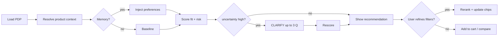

### Ten personas — step by step

#### 1. First-time anonymous

1. Lands on PDP; widget loads **without** PII.
2. Sees **fit confidence meter** + **return-risk** badge (category permitting).
3. If **high uncertainty**, sees **one** primary question (e.g., “usual size in Brand X?”).
4. On answer, scores update; **explanation** references **merchant + review** evidence.
5. **Memory**: session storage only; prompt to create account to save.

#### 2. Logged-in repeat

1. Memory service injects **last category preferences** (e.g., footwear width).
2. Default variant **pre-selected** when confidence sufficient.
3. **Low-friction**: “Still true?” inline confirm for stale prefs.

#### 3. Between sizes

1. Engine runs **between-size policy** (see §5).
2. UI shows **A vs B tradeoff** (e.g., toe room vs heel slip).
3. If tie, **`CONSIDER_ALTERNATIVE`** surfaces half-size or wide option.

#### 4. Fit-sensitive apparel

1. Questions prioritize **body shape** and **fabric stretch** (derived features).
2. **Return-risk** bumps on **final sale** + **low stretch** + **ambiguous size**.

#### 5. High-return-risk SKU

1. **returnRisk > τ_warn** → amber module; **> τ_block** (soft) → suggest alternative as primary CTA companion.
2. Copy is **non-alarmist**: “Higher than typical mismatch risk for this category.”

#### 6. Vague uncertainty

1. **High epistemic uncertainty** → clarification before strong claims.
2. LLM explanation **hedges** and cites **sparse evidence**.

#### 7. Alternative suggestions

1. **`alternatives[]`** always populated when **primary risk high** or **fitConfidence** middling.
2. Cards show **tradeoffs** and **safer dimensions**.

#### 8. Cart-stage warning

1. On cart open, **re-evaluate** with cart context (multi-item constraints optional).
2. If **risk increased** (e.g., wrong width added), **inline fix**: swap variant.

#### 9. Filter-driven refinement

1. User applies **sidebar filters**; client sends `filterState`.
2. Orchestrator **reranks** candidates; **chips** explain “why these narrowed”.

#### 10. Remembered preferences

1. **Explicit** controls: “Forget footwear width.”
2. **Inferred** prefs shown as **“suggested from behavior”** with opt-out.

### UI logic matrix

| Condition | UI |
|-----------|-----|
| `fitConfidence ≥ 0.8` and `returnRisk ≤ 0.35` | Strong **BUY** affordance; short explanation |
| `0.55 ≤ fitConfidence < 0.8` | Show **tradeoffs** + optional **1 question** |
| `fitConfidence < 0.55` or `returnRisk > 0.55` | **CLARIFY** or **CONSIDER_ALTERNATIVE** dominant |
| `uncertainty.total > 0.45` | Suppress overconfidence; widen bands in copy |
| Clarification exhausted | Switch to **REFINE** chips + filters |

---

## 4. Return Prevention Engine Design

### Signals

| Signal | Source | Use |
|--------|--------|-----|
| Historical return rate | Merchant RMS | Prior by SKU/category |
| Return reasons | RMS, support taxonomy | Label fit vs color vs defect |
| Exchange outcomes | OMS | Size swap success proxy |
| Product attributes | PIM | Dimensions, materials |
| Review sentiment | Reviews NLP | runs small, stiff, narrow |
| User behavior | Web SDK | PDP dwell, compare, returns to PDP |
| Fit mismatch patterns | Returns + reviews | Brand-level calibration |

### Return-risk taxonomy (18 categories)

1. SIZE_TOO_SMALL  
2. SIZE_TOO_LARGE  
3. WIDTH_MISMATCH  
4. LENGTH_MISMATCH (inseam, sleeve)  
5. COLOR_NOT_AS_EXPECTED  
6. MATERIAL_FEEL_MISMATCH  
7. QUALITY_DEFECT  
8. NOT_AS_PICTURED  
9. ARRIVED_LATE (non-preventable for fit engine)  
10. CHANGED_MIND  
11. GIFT_RECIPIENT_REJECT  
12. COMPATIBILITY_ISSUE  
13. PERFORMANCE_MISMATCH (use case)  
14. COMFORT_FIT (subjective)  
15. PACKAGING_DAMAGE  
16. DUPLICATE_ORDER  
17. FRAUD_OR_ABUSE  
18. OTHER  

**Preventable** (engine focus): 1–6, 9 (if expectation issue tied to description), 13, 14 (partially).  
**Non-preventable / out of scope**: 8–12, 15–17 unless description-driven.

### Preventable vs non-preventable

```typescript
export const preventableReasonCodes = new Set<string>([
  'SIZE_TOO_SMALL','SIZE_TOO_LARGE','WIDTH_MISMATCH','LENGTH_MISMATCH',
  'COLOR_NOT_AS_EXPECTED','MATERIAL_FEEL_MISMATCH','PERFORMANCE_MISMATCH','COMFORT_FIT'
]);
```

### Risk scoring pipeline

```pseudo
function returnRiskScore(product, variant, userContext, signals) {
  base = categoryPrior(product.categoryId, signals.globalPriors)
  skuLift = skuReturnRate(variant.skuId, signals.returnStats)
  reasonMix = decomposeReasons(variant.skuId, signals.returnReasons)
  reviewPenalty = extractMismatchHints(signals.reviews, product.categoryId)
  behaviorSpike = sessionReturnIntentSignals(userContext.session)
  subjective = comfortAmbiguity(product.attributes)
  score = sigmoid(w1*skuLift + w2*reasonMix.fitShare + w3*reviewPenalty + w4*subjective - w5*behaviorSpike)
  return clamp(score, 0, 1)
}
```

### Thresholds (illustrative defaults)

| Threshold | Value | Action |
|-----------|-------|--------|
| τ_info | 0.35 | Show subtle risk hint |
| τ_warn | 0.55 | Prominent warning + alternatives |
| τ_soft_block | 0.72 | Default CTA shifts to “Review alternatives” (merchant configurable) |

### Architecture (pipeline)

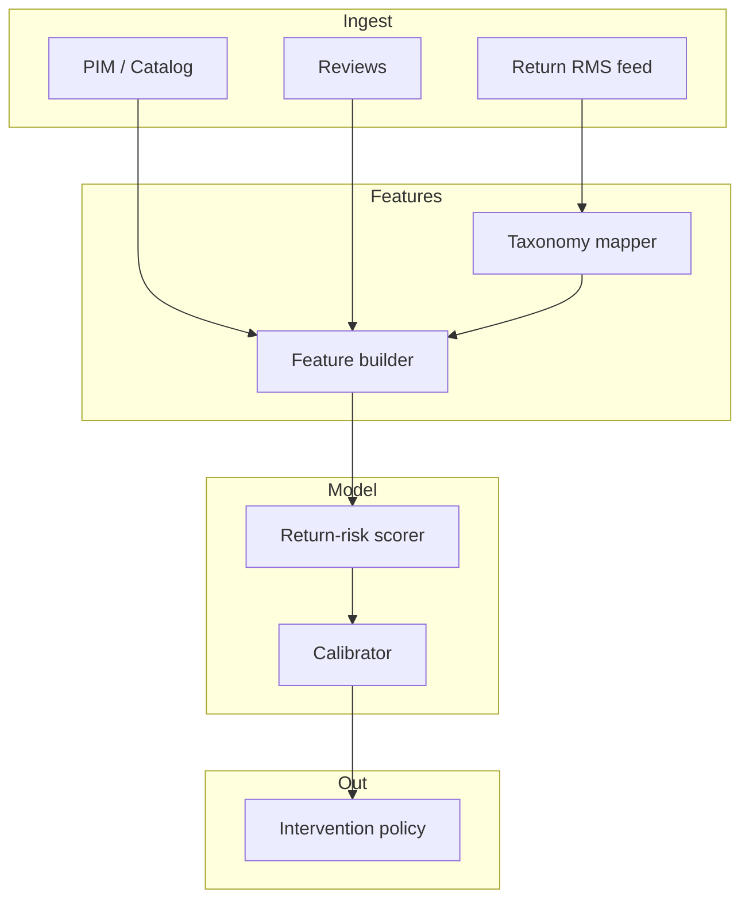

### Example output (JSON fragment)

```json
{
  "returnRisk": 0.61,
  "drivers": [
    { "code": "SIZE_TOO_LARGE", "weight": 0.42 },
    { "code": "WIDTH_MISMATCH", "weight": 0.21 }
  ],
  "preventableShare": 0.78
}
```

---

## 5. Fit Confidence Engine Design

### Category flexibility

| Category | Key dimensions | Notes |
|----------|----------------|-------|
| Apparel | chest, waist, inseam, stretch | brand deltas |
| Footwear | length, width, arch, use | between-size common |
| Furniture | dimensions, doorways, firmness | spatial constraints |
| Beauty | skin type, concerns | patch-test / sensitivity |
| Travel gear | airline limits, capacity | constraint satisfaction |
| Home goods | compatibility, dimensions | SKU fit to space |
| Accessories | circumference, strap length | simple measurement |

### Between-size logic (conceptual)

```pseudo
function betweenSizeRecommendation(measurements, brandCurve, sku) {
  ideal = projectToBrandCurve(measurements, brandCurve)
  candidates = neighboringSizes(sku.sizeLabel)
  scores = candidates.map(c => ({
    id: c.id,
    fit: softFitScore(ideal, c),
    pain: penaltyForTightness(c, userPreferences)
  }))
  return paretoPick(scores, userPreferences.priority) // e.g., comfort > aesthetics
}
```

### Confidence dimensions

| Dimension | Description |
|-----------|-------------|
| **Measurement fit** | Distance to recommended size region |
| **Preference fit** | Style/silhouette vs stated prefs |
| **Evidence strength** | Count/quality of corroborating signals |
| **Stability** | Variance across reviews for that attribute |

### Scoring (baseline formula family)

Let \(f_i\) be normalized features in \([0,1]\), weights \(\sum w_i = 1\):

\[
\text{fitConfidence} = \sigma\Big( \sum_i w_i f_i - \lambda \cdot \text{uncertainty.total} \Big)
\]

Where \(\sigma\) is logistic; **uncertainty** penalty prevents false certainty.

### Fit evidence model

```typescript
export interface FitEvidence {
  id: string;
  kind: 'SIZE_CHART' | 'REVIEW_PHRASE' | 'MERCHANT_NOTE' | 'MEASUREMENT';
  text?: string;
  polarity?: 'RUNS_SMALL' | 'TRUE_TO_SIZE' | 'RUNS_LARGE';
  confidence: number;
  scope: 'SKU' | 'BRAND' | 'CATEGORY';
}
```

### Uncertainty model

```typescript
export interface UncertaintyBreakdown {
  epistemic: number; // sparse data, new SKU
  aleatoric: number; // inherent subjective comfort
  total: number;     // e.g., sqrt(e^2 + a^2) or max(e,a)
}
```

### Alternative logic

```pseudo
function alternatives(primary, catalogSlice, user) {
  pool = filterCompatible(catalogSlice, mustHave=user.constraints)
  ranked = pool.map(p => ({
    productId: p.id,
    score: fitConfidence(p, user) * (1 - returnRisk(p)) * availabilityBoost(p)
  }))
  return diversifyMMR(ranked, lambda=0.7)
}
```

### Example output

```json
{
  "fitConfidence": 0.74,
  "recommendedVariantIds": ["var_8821"],
  "uncertainty": { "epistemic": 0.22, "aleatoric": 0.18, "total": 0.29 },
  "betweenSizeNote": "If you prioritize toe room over a snug heel, choose half size up."
}
```

---

## 6. Learning, Memory, Recall, and Relational Reasoning

### Five learning levels

| Level | Scope | Storage | TTL |
|-------|-------|---------|-----|
| **Session** | Current visit | Redis | hours |
| **User** | Account | Postgres JSONB | months–years |
| **Tenant** | Merchant defaults | Postgres | versioned |
| **Category** | Vertical priors | Model store + Postgres | slow refresh |
| **Global** | Cross-tenant priors | Offline warehouse | quarterly |

### Behaviors tracked (18 types)

1. PDP_VIEW  
2. SIZE_TOGGLE  
3. QUESTION_ANSWER  
4. CHIP_CLICK  
5. FILTER_APPLY  
6. COMPARE_ADD  
7. ATC  
8. CHECKOUT_START  
9. RETURN_INITIATED (if integrated)  
10. EXCHANGE_COMPLETED  
11. EXPLICIT_PREFERENCE_SET  
12. EXPLICIT_PREFERENCE_CLEAR  
13. WIDGET_DISMISS  
14. WIDGET_EXPAND  
15. SCROLL_DEPTH  
16. RE_EXPLAIN_REQUEST  
17. ALTERNATIVE_SELECT  
18. MEMORY_EXPORT_REQUEST  

### Explicit vs inferred

| Type | Example | Strength |
|------|---------|----------|
| Explicit | “I prefer wide” | Strong |
| Inferred | Chose wide 3× | Medium → Strong with decay |

### Memory layers

- **Decay**: exponential half-life per key (e.g., footwear width 180d).
- **Transparency**: UI lists **what we remember** and **why**.
- **User controls**: delete category, delete key, pause learning.

### Relational reasoning

| Relation | Use |
|----------|-----|
| Similar products | Embeddings + attribute graph |
| Safer substitutes | Lower return-risk + fitConfidence |
| Premium upgrades | Higher spec, same constraints |
| Cheaper alternatives | Price down, risk bounded |

### Event schema (sketch)

```typescript
export interface BehaviorEvent {
  id: string;
  tenantId: string;
  userId?: string;
  sessionId: string;
  type: string;
  payload: Record<string, unknown>;
  ts: string;
}
```

### Retrieval & conflict resolution

```pseudo
function retrieveMemory(userId, categoryId) {
  prefs = loadUserPrefs(userId)
  tenantDefaults = loadTenantDefaults(tenantId, categoryId)
  merged = mergeWithPrecedence(prefs, tenantDefaults) // user > tenant
  return applyDecay(merged, now)
}

function resolveConflict(a, b) {
  if (a.sourceRank != b.sourceRank) return higherRank(a,b)
  return newerWins(a,b)
}
```

---

## 7. Filters, Refinement, and Guided Narrowing

### Hybrid system

- **AI clarification** for *missing intent* (measurement, use case).
- **Visible filters** for *structured constraints* (price, color).
- **Smart chips** for *fast rerank* with explanations.
- **Conversational refinement** optional; must map to `filterPatch`.

### Refinement dimensions

| Dimension | Example chip |
|-----------|--------------|
| Price | “Under $120” |
| Brand | “Same brand only” |
| Color | “Neutral tones” |
| Size | “US 9–9.5” |
| Style | “Wide toe box” |
| Material | “Leather upper” |
| Use case | “Standing 8+ hours” |
| Return-risk tolerance | “Lower risk only” |
| Derived traits | “Runs narrow brands excluded” |

### Data model (filter state)

```typescript
export interface FilterState {
  price?: { min?: number; max?: number; currency: string };
  brandIds?: string[];
  colorFamilies?: string[];
  sizes?: string[];
  attributes?: Record<string, string[]>;
  maxReturnRisk?: number;
}
```

### API contract

`POST /v1/refine`

```json
{
  "tenantId": "t_1",
  "sessionId": "s_1",
  "productSetId": "ps_99",
  "filterState": { "price": { "max": 150, "currency": "USD" }, "maxReturnRisk": 0.45 },
  "userContext": { "categoryId": "cat_footwear" }
}
```

### State logic (pseudo)

```pseudo
onFilterChange(state):
  candidates = catalog.query(state)
  ranked = rank(candidates, userContext, memory)
  chips = suggestNextChips(state, ranked.explain())
  return { ranked, chips }
```

---

## 8. Community Feedback Enrichment (including Reddit)

### Principles

- **Labeled** as community-sourced, never as merchant guarantee.
- **Secondary evidence** only; cannot override merchant safety or legal.
- **Freshness** windows (e.g., 90d) and **quality** filters (min karma/subscribers configurable externally).

### Ingestion strategy

1. Construct queries: `"{brand} {model} sizing"`, `"{sku} wide feet"`.
2. Fetch from approved connectors (Reddit API, public forums if licensed).
3. **Dedupe** threads; **extract claims** with NLP.
4. **Contradiction handling**: show distribution, not single opinion.

### Sentiment aggregation

\[
\text{communityScore} = \tanh\Big( \sum_k \alpha_k \cdot \text{voteWeight}_k \cdot \text{sentiment}_k \Big)
\]

### UI presentation

- Module: **“Community mentions (unverified)”**
- Show **recency**, **sample size**, **contradiction badge** if high variance.

### Category examples

| Category | Example queries |
|----------|-----------------|
| Footwear | “Ultraboost sizing vs Nike” |
| Denim | “raw denim shrink vs tag size” |
| Sofas | “Burrow Nomad firm for back pain” |
| Skincare | “tretinoin purge vs breakout” |
| Luggage | “Away carry-on international” |
| Vacuums | “Dyson pet hair hardwood” |

---

## 9. System Architecture

### Component catalog

| Component | Purpose | Inputs | Outputs | Storage | Latency | MVP | Scale-up | Failure mode |
|-----------|-----------|--------|---------|---------|---------|-----|----------|--------------|
| Web app | Merchant admin + demo | HTTP | HTML/JS | CDN | low | Next.js | SSR cache | static fallback |
| API gateway | Auth, rate limits | HTTP | routed | Redis | low | Kong/NGINX | regional | 429 storm |
| Orchestration | Pipeline glue | DecisionRequest | DecisionResponse | Redis state | med | NestJS service | horizontal | circuit break |
| Fit intelligence | Scores | features | scores | pgvector | med | rules+LLM | learned models | default priors |
| Return-risk | Risk | signals | risk | Postgres | med | SQL+model | GBM | high prior |
| Ranking/decision | Action choice | scores | action | — | low | deterministic | LTR | safe default BUY→CLARIFY |
| Review intelligence | NLP features | reviews | phrases | S3+ES | high async | batch | streaming | skip NLP |
| Memory/preference | Recall | events | prefs | Postgres | low | CRUD | sharding | read-only mode |
| Behavioral learning | Signal | events | weights | Redis+BQ | async | batch | online | degrade to no-learn |
| Alternative rec | MMR ranking | catalog | list | — | med | heuristic | embeddings | fewer alts |
| Filter/refinement | Narrowing | filters | ranked | catalog | med | SQL | OLAP | coarse filter |
| Community | Enrichment | URLs | snippets | cache | high | optional off | cluster | empty module |
| Product normalization | Canonical SKUs | feeds | graph | Postgres | batch | scripts | dbt | quarantine bad rows |
| Analytics | KPIs | events | dashboards | BQ | async | Segment compat | — | sampled |
| Admin | Config | users | flags | Postgres | low | NestJS | SSO | read-only |
| Model training | Offline | warehouse | artifacts | GCS | offline | notebook | pipeline | rollback model |

### Architecture diagram

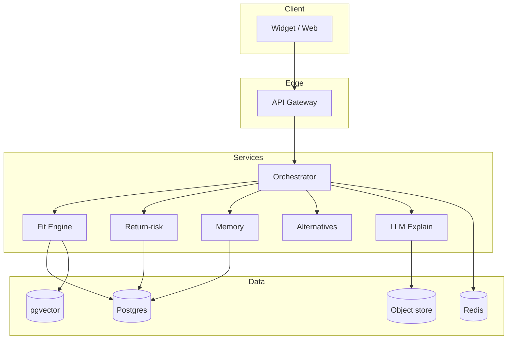

### Sequence: PDP recommendation

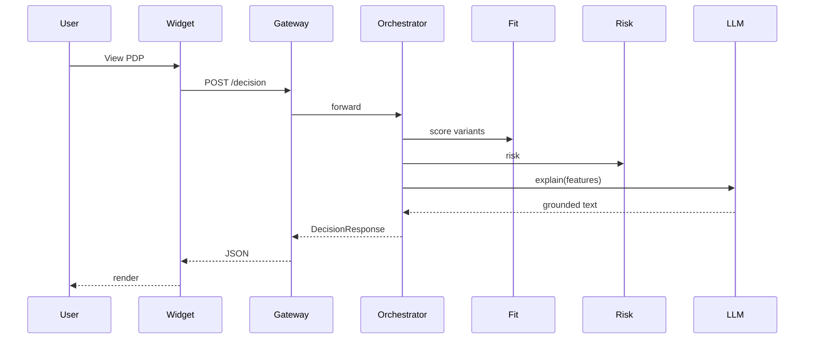

### Sequence: clarification-required

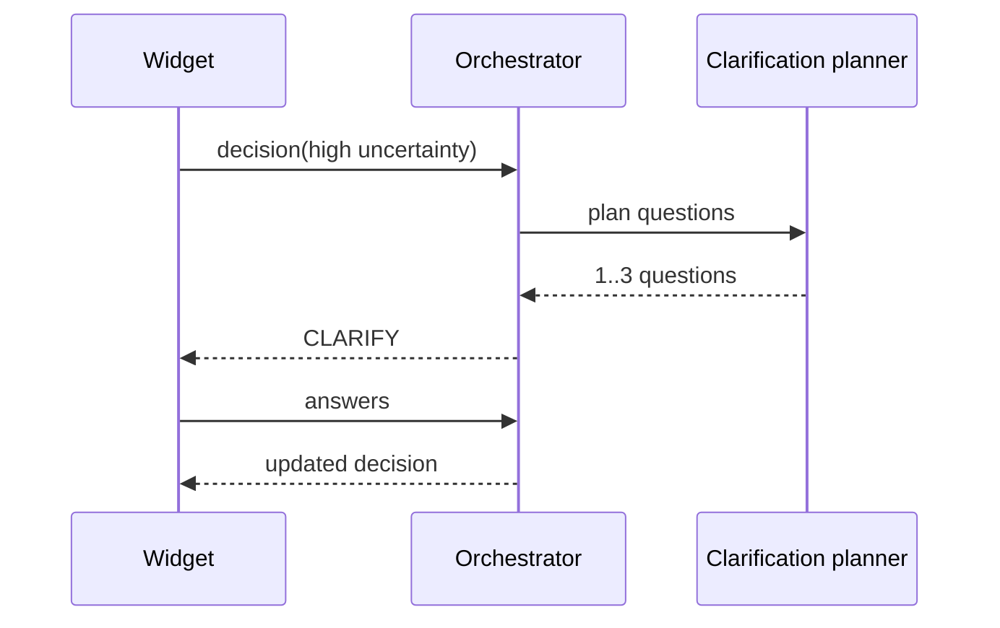

### Sequence: filter refinement reranking

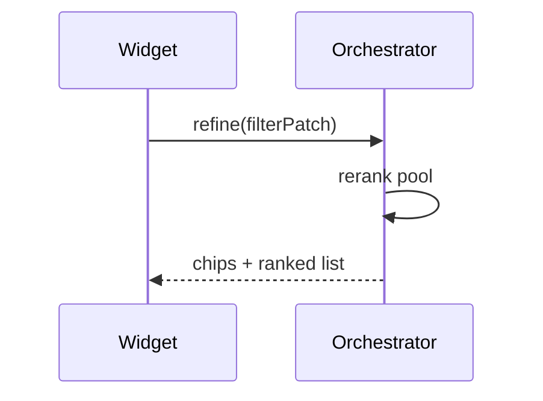

### Sequence: repeat session with memory

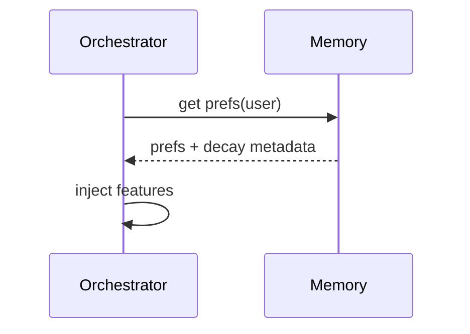

### Sequence: API-embedded usage

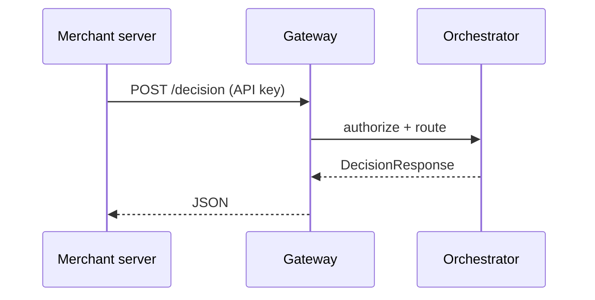

### Sequence: hosted SaaS usage

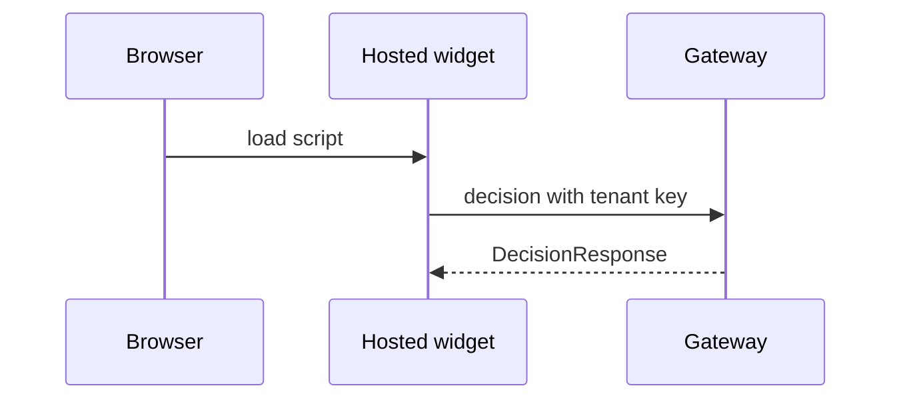

---

## 10. API and Hosted Product Design

### A. API-powered product

#### Endpoints (REST, versioned `/v1`)

| Method | Path | Purpose |
|--------|------|---------|
| POST | `/v1/decision` | Full `DecisionResponse` |
| POST | `/v1/fit-confidence` | Fit-only scores |
| POST | `/v1/size-recommendation` | Variant picks + between-size notes |
| POST | `/v1/return-risk` | Risk-only |
| POST | `/v1/clarification` | Next questions given partial answers |
| POST | `/v1/alternatives` | Substitutes |
| POST | `/v1/filter-suggestion` | Chips + patches |
| GET/POST | `/v1/memory` | Read/write user prefs |
| POST | `/v1/feedback` | Thumbs + reasons |
| POST | `/v1/behavior` | Batch behavior events |
| POST | `/v1/community/enrich` | Optional async enrichment |
| POST | `/v1/admin/eval` | Offline eval hooks (protected) |

#### SDK strategy

- **TypeScript** SDK (`@rpfit/sdk`) with typed `DecisionResponse`.
- **Idempotency-Key** header on `POST` writes.
- **Server-side** secret keys; **publishable** keys for widget (scoped).

#### Auth / tenant model

```typescript
export interface AuthContext {
  tenantId: string;
  principal: 'MERCHANT_SERVER' | 'WIDGET' | 'USER';
  scopes: string[];
}
```

#### Rate limits (example)

| Key type | RPM | Burst |
|----------|-----|-------|
| Server | 3000 | 6000 |
| Widget | 600 | 1200 |

#### Versioning

- URL path `/v1`; **deprecation** 6 months; **sunset** headers.

### B. Hosted / online SaaS

| Area | Features |
|------|----------|
| Onboarding | Tenant, domain allowlist, API keys |
| Feed ingestion | CSV, Shopify bulk, scheduled SFTP |
| Review/return import | Connectors + mapping UI |
| Widget config | Colors, copy, thresholds |
| Dashboard | Return-risk distribution, clarification funnel |
| Analytics | ATC, conversion, estimated prevented returns |
| Testing console | Fixture PDPs, replay requests |
| Theme | CSS variables, border radius |

### Comparison: API vs Hosted

| | API-only | Hosted widget |
|--|----------|---------------|
| Pros | Full control, headless | Faster merchant time-to-value |
| Cons | Integration effort | Theming constraints |
| Best for | Custom stacks | SMB merchants |

### Monetization (recap)

- Tiered SaaS + API overage + enterprise SSO/support.

---

## 11. Integration Strategy

### Three tiers

| Tier | Data included | Capabilities unlocked | Quality | Defaults / fallbacks |
|------|---------------|----------------------|---------|----------------------|
| **Basic** | Catalog + variants + images | Fit scoring on **structured** attrs; generic priors | Medium | Brand curve from **category** prior |
| **Intermediate** | + reviews + inventory + promos | Review NLP features; stock-aware alternatives | High | Cold-start from **similar** SKUs |
| **Advanced** | + returns/exchanges + behavioral | Calibrated return-risk; learning loops | Highest | Merchant-specific **threshold** profiles |

### Tier detail

#### Basic (catalog only)

- **Capabilities**: size recommendation from charts; deterministic clarification; generic return-risk prior by category.
- **Improvements vs nothing**: still better than static grid—**asks minimum questions**.
- **Fallbacks**: if size chart missing → **measurement** question + **wide confidence bands**.

#### Intermediate (+ reviews + availability)

- **Capabilities**: text signals (“runs narrow”); hide OOS alternatives; confidence from evidence count.
- **Improvements**: materially better **footwear/apparel** fit.
- **Fallbacks**: review API stale → decay NLP weight to 0; rely on merchant attrs.

#### Advanced (full data)

- **Capabilities**: SKU-level return reason mix; exchange success; session behavior features.
- **Improvements**: calibrated **returnRisk**; merchant-specific intercepts.
- **Fallbacks**: if return feed delayed → **time-decayed** last snapshot + **uncertainty** bump.

### Integration modes

| Mode | Description |
|------|-------------|
| **SDK** | `@rpfit/sdk` server + browser entrypoints |
| **Headless API** | Merchant backend calls `/v1/decision` |
| **Embedded widget** | `<script>` + web component |
| **Shopify adapter** | Theme app embed + Admin API sync job |
| **Magento / BigCommerce** | Extension + cron feeds |

### Sync patterns

| Pattern | Use |
|---------|-----|
| **Catalog feed sync** | Nightly bulk + hourly delta |
| **Webhook sync** | `products/update`, `inventory_levels/update` |
| **Review import** | Connector pulls + `lastSyncedAt` cursor |
| **Return import** | RMS CSV/SFTP or API |
| **Session mapping** | `sessionId` from cookie; `userId` when auth |

### Setup paths

| Horizon | Steps | Pitfalls |
|---------|-------|----------|
| **1 day** | API key, static JSON catalog (100 SKUs), widget on staging | Wrong **variant IDs** vs storefront |
| **1 week** | Feed automation, review hook, basic dashboard | **Unit mismatch** (cm vs in) not normalized |
| **Common pitfalls** | Duplicate SKUs across locales; missing width variants; sale-only inventory skewing alternatives |

---

## 12. Data Model and Schemas

This section defines **30+** canonical TypeScript entities used across API, storage, and training exports.

### Core tenancy & access

```typescript
export interface Tenant {
  id: string;
  name: string;
  plan: 'STARTER' | 'GROWTH' | 'ENTERPRISE';
  createdAt: string;
  settings: TenantSettings;
}

export interface TenantSettings {
  defaultCurrency: string;
  locale: string;
  riskThresholds: { info: number; warn: number; softBlock: number };
  allowCommunityEnrichment: boolean;
  dataRetentionDays: number;
}

export interface ApiKey {
  id: string;
  tenantId: string;
  kind: 'SERVER_SECRET' | 'WIDGET_PUBLISHABLE';
  prefix: string;
  scopes: string[];
  createdAt: string;
  lastUsedAt?: string;
  revokedAt?: string;
}

export interface WebhookSubscription {
  id: string;
  tenantId: string;
  url: string;
  secret: string;
  events: Array<'decision.logged' | 'catalog.synced' | 'model.promoted'>;
}
```

### Catalog graph

```typescript
export interface Brand {
  id: string;
  tenantId: string;
  name: string;
  slug: string;
  brandCurveId?: string;
}

export interface Category {
  id: string;
  tenantId: string;
  name: string;
  parentId?: string;
  kind: 'APPAREL' | 'FOOTWEAR' | 'FURNITURE' | 'BEAUTY' | 'TRAVEL' | 'HOME' | 'ACCESSORIES' | 'OTHER';
}

export interface Product {
  id: string;
  tenantId: string;
  brandId: string;
  categoryId: string;
  title: string;
  description?: string;
  handle: string;
  status: 'ACTIVE' | 'DRAFT' | 'ARCHIVED';
  attributes: Record<string, AttributeValue>;
  createdAt: string;
  updatedAt: string;
}

export interface AttributeDefinition {
  key: string;
  tenantId: string;
  label: string;
  type: 'STRING' | 'NUMBER' | 'ENUM' | 'BOOLEAN';
  enumOptions?: string[];
  unit?: 'IN' | 'CM' | 'OZ' | 'G' | 'LB' | 'KG';
}

export interface AttributeValue {
  key: string;
  value: string | number | boolean | string[];
  provenance: 'MERCHANT' | 'IMPORTED' | 'DERIVED';
  confidence?: number;
}

export interface Variant {
  id: string;
  productId: string;
  sku: string;
  barcode?: string;
  optionValues: Record<string, string>; // e.g., { Size: "M", Color: "Black" }
  price: Money;
  compareAtPrice?: Money;
  inventoryQuantity?: number;
  weightGrams?: number;
  dimensions?: Dimensions;
}

export interface Money {
  amount: string; // decimal string
  currency: string;
}

export interface Dimensions {
  length: number;
  width: number;
  height: number;
  unit: 'IN' | 'CM';
}

export interface InventorySnapshot {
  variantId: string;
  capturedAt: string;
  quantity: number;
  policy: 'DENY' | 'CONTINUE' | 'BACKORDER';
}
```

### Normalization & embeddings

```typescript
export interface ProductNormalized {
  productId: string;
  canonicalTitle: string;
  tokenFingerprint: string;
  embeddingId?: string;
  duplicateOfProductId?: string;
}

export interface ProductEmbedding {
  id: string;
  productId: string;
  model: string;
  vector: number[]; // stored in pgvector
  createdAt: string;
}

export interface SizeChart {
  id: string;
  tenantId: string;
  productId?: string;
  brandId?: string;
  categoryId?: string;
  unit: 'IN' | 'CM';
  rows: SizeChartRow[];
}

export interface SizeChartRow {
  label: string; // "M", "32x32"
  measurements: Record<string, number>; // chest, waist, etc.
}
```

### Reviews & NLP-derived signals

```typescript
export interface Review {
  id: string;
  tenantId: string;
  productId: string;
  variantId?: string;
  rating: number;
  title?: string;
  body: string;
  author?: string;
  locale?: string;
  createdAt: string;
  helpfulCount?: number;
}

export interface ReviewSignal {
  id: string;
  reviewId: string;
  code:
    | 'RUNS_SMALL'
    | 'TRUE_TO_SIZE'
    | 'RUNS_LARGE'
    | 'NARROW'
    | 'WIDE'
    | 'STIFF'
    | 'SOFT'
    | 'SHORT'
    | 'LONG'
    | 'ITCHY'
    | 'SEE_THROUGH'
    | 'COLOR_MISMATCH';
  confidence: number;
  spans?: Array<{ start: number; end: number }>;
}
```

### Returns & exchanges

```typescript
export interface ReturnRecord {
  id: string;
  tenantId: string;
  orderId: string;
  lineItemId: string;
  sku: string;
  variantId?: string;
  reasonCode: string;
  rawReason?: string;
  amount: Money;
  createdAt: string;
}

export interface ReturnReason {
  code: string;
  category: 'PREVENTABLE_FIT' | 'EXPECTATION' | 'QUALITY' | 'LOGISTICS' | 'OTHER';
}

export interface ExchangeRecord {
  id: string;
  tenantId: string;
  orderId: string;
  fromVariantId: string;
  toVariantId: string;
  outcome: 'SUCCESS' | 'FAIL' | 'PENDING';
  createdAt: string;
}
```

### Users, sessions, memory

```typescript
export interface User {
  id: string;
  tenantId: string;
  externalId?: string;
  emailHash?: string;
  createdAt: string;
}

export interface Session {
  id: string;
  tenantId: string;
  userId?: string;
  startedAt: string;
  userAgent?: string;
}

export interface MemoryState {
  userId: string;
  tenantId: string;
  categoryId: string;
  prefs: Record<string, unknown>;
  provenance: Record<string, 'EXPLICIT' | 'INFERRED'>;
  updatedAt: string;
  expiresAt?: Record<string, string>;
}

export interface PreferenceDelta {
  key: string;
  oldValue?: unknown;
  newValue: unknown;
  source: 'EXPLICIT' | 'INFERRED';
  confidence: number;
}
```

### Requests & scoring artifacts

```typescript
export interface DecisionRequest {
  schemaVersion: '1.0.0';
  tenantId: string;
  requestId?: string;
  sessionId: string;
  userId?: string;
  productId: string;
  candidateVariantIds?: string[];
  userContext: UserContext;
  filterState?: FilterState;
  mode: 'PDP' | 'CART' | 'COMPARE' | 'SEARCH';
}

export interface UserContext {
  measurements?: Record<string, number>;
  measurementUnit?: 'IN' | 'CM';
  answers?: Record<string, unknown>;
  statedUseCase?: string;
  constraints?: { maxPrice?: Money; mustHave?: string[]; avoid?: string[] };
  priorVariantPurchases?: string[];
}

export interface ScoringFeatureVector {
  id: string;
  requestId: string;
  tenantId: string;
  productId: string;
  variantId: string;
  version: string;
  features: Record<string, number>;
  createdAt: string;
}

export interface CalibrationBucket {
  id: string;
  modelVersion: string;
  bucketKey: string;
  predictedMean: number;
  observedMean: number;
  count: number;
}

export interface FitModelArtifact {
  id: string;
  version: string;
  categoryKind: Category['kind'];
  uri: string;
  metrics: Record<string, number>;
  createdAt: string;
}

export interface ReturnRiskModelArtifact {
  id: string;
  version: string;
  tenantId?: string;
  uri: string;
  metrics: Record<string, number>;
  createdAt: string;
}
```

### Merchant rules & widget

```typescript
export interface MerchantRule {
  id: string;
  tenantId: string;
  priority: number;
  match: { categoryIds?: string[]; brandIds?: string[]; productIds?: string[] };
  action:
    | { type: 'FORCE_CLARIFY'; questionIds: string[] }
    | { type: 'ADJUST_THRESHOLD'; riskDelta: number }
    | { type: 'BLOCK_ALTERNATIVE'; productId: string };
}

export interface WidgetConfig {
  tenantId: string;
  theme: {
    primary: string;
    surface: string;
    text: string;
    riskInfo: string;
    riskWarn: string;
    confidenceHigh: string;
    confidenceLow: string;
    radiusPx: number;
    fontBody: string;
    fontHeading: string;
  };
  copy: {
    moduleTitle: string;
    clarifyTitle: string;
    communityDisclaimer: string;
  };
  thresholds: { showModuleMinWidth: number };
}
```

### Community & operations

```typescript
export interface CommunityThread {
  id: string;
  source: 'REDDIT' | 'FORUM' | 'OTHER';
  url: string;
  title: string;
  fetchedAt: string;
  qualityScore: number;
}

export interface CommunityClaim {
  id: string;
  threadId: string;
  text: string;
  sentiment: number;
  mappedCodes: ReviewSignal['code'][];
  confidence: number;
}

export interface CatalogSyncJob {
  id: string;
  tenantId: string;
  status: 'QUEUED' | 'RUNNING' | 'SUCCESS' | 'FAILED';
  startedAt: string;
  finishedAt?: string;
  stats: { upserted: number; deleted: number; errors: number };
}

export interface ReviewImportBatch {
  id: string;
  tenantId: string;
  source: string;
  cursor?: string;
  imported: number;
  createdAt: string;
}

export interface ReturnImportBatch {
  id: string;
  tenantId: string;
  source: string;
  imported: number;
  createdAt: string;
}

export interface AuditLog {
  id: string;
  tenantId: string;
  actor: string;
  action: string;
  payload: Record<string, unknown>;
  createdAt: string;
}

export interface ExperimentAssignment {
  id: string;
  tenantId: string;
  userId?: string;
  sessionId: string;
  experimentKey: string;
  variant: string;
  assignedAt: string;
}
```

### Example JSON: `Product` + `Variant`

```json
{
  "product": {
    "id": "prod_501",
    "tenantId": "t_1",
    "brandId": "br_12",
    "categoryId": "cat_footwear",
    "title": "Trail Runner X",
    "handle": "trail-runner-x",
    "status": "ACTIVE",
    "attributes": {
      "upper": { "key": "upper", "value": "mesh", "provenance": "MERCHANT" },
      "drop_mm": { "key": "drop_mm", "value": 8, "provenance": "MERCHANT" }
    }
  },
  "variants": [
    {
      "id": "var_9001",
      "productId": "prod_501",
      "sku": "TRX-9-W",
      "optionValues": { "Size": "9", "Width": "Wide" },
      "price": { "amount": "139.00", "currency": "USD" },
      "inventoryQuantity": 14
    }
  ]
}
```

### Example JSON: `MemoryState`

```json
{
  "userId": "usr_77",
  "tenantId": "t_1",
  "categoryId": "cat_footwear",
  "prefs": {
    "footwear.widthPreference": "WIDE",
    "footwear.cushioningPreference": "HIGH",
    "footwear.usualBrands": ["br_12", "br_44"]
  },
  "provenance": {
    "footwear.widthPreference": "EXPLICIT",
    "footwear.cushioningPreference": "INFERRED"
  },
  "updatedAt": "2026-03-30T12:00:00Z"
}
```

---

## 13. Signals and Feature Engineering

### Signal sources → features

| Source | Raw signal | Derived feature |
|--------|------------|-----------------|
| Product metadata | inseam length | `inseam_delta_to_user` |
| Size chart | M chest | `chart_fit_distance` |
| Variants | SKU width | `width_match` |
| Inventory | qty | `availability_boost` |
| Review text | “narrow toebox” | `review_narrow_toe` |
| Return reasons | SIZE_TOO_LARGE | `sku_size_large_rate` |
| Exchange | swap 9→8.5 | `exchange_down_frequency` |
| Behavior | compare adds | `intent_seriousness` |
| Memory | wide preference | `pref_width_alignment` |
| Merchant rules | force clarify | `rule_override` |

### Text-extracted signals (examples)

| Phrase family | Mapped codes |
|---------------|----------------|
| “runs small”, “size up” | `RUNS_SMALL` |
| “TTS”, “true to size” | `TRUE_TO_SIZE` |
| “narrow”, “cramped toe” | `NARROW` |
| “stiff out of box” | `STIFF` |
| “soft and plush” | `SOFT` |

### Raw → derived pipeline

```pseudo
function buildFeatureVector(product, variant, user, signals):
  raw = collectRaw(signals)
  text = nlpExtract(signals.reviews)
  derived = {
    chart_fit_distance: chartDistance(user.measurements, variant, product.sizeChart),
    review_phrase_alignment: align(text, user.prefs),
    sku_return_fit_share: fitShare(signals.returns, variant.sku),
    stock: logistic(signals.inventory[variant.id]),
    memory: memoryBoost(user.memory, variant)
  }
  confidence = evidenceStrength(derived)
  return normalize(derived), confidence
```

### Sparse-data fallback

- **Cold SKU**: borrow **brand+category** priors; increase `epistemic`.
- **No reviews**: set NLP weights to 0; rely on attrs + chart.
- **Decay**: half-life on review-derived features by SKU age.

### Category feature tables (abbrev.)

| Feature | Apparel | Footwear | Furniture |
|---------|---------|----------|-----------|
| `stretch` | high | low | n/a |
| `door_clearance` | n/a | n/a | high |
| `stack_height` | n/a | medium | n/a |

---

## 14. Ranking, Fit Scoring, and Return-Risk Modeling

### Score outputs

| Score | Range | Meaning |
|-------|-------|---------|
| `fitConfidence` | 0–1 | Likely match to intent |
| `returnRisk` | 0–1 | Likely preventable mismatch |
| `sizeRecommendation` | rank list | Variant ordering |
| `alternativeScore` | 0–1 | Substitute quality |
| `explanationConfidence` | 0–1 | Grounding strength |
| `uncertainty.total` | 0–1 | Should hedge |

### MVP approach

- **Hybrid**: engineered features + **deterministic** rules for action + **LLM** only for **explanation** from JSON features (no free numerics from LLM).

### Production path

- Calibrated classifiers / regressors per category.
- **Learning-to-rank** for alternatives with pairwise preferences from outcomes.

### Baseline formulas

**Fit logit** (training replaces weights):

\[
z_{\text{fit}} = \beta_0 + \sum_j \beta_j x_j - \gamma \, u
\]
\[
\text{fitConfidence} = \frac{1}{1 + e^{-z_{\text{fit}}}}
\]

**Return risk**:

\[
\text{returnRisk} = \sigma\big( w_r \cdot \text{skuRate} + w_f \cdot \text{fitReasonShare} + w_n \cdot \text{nlpMismatch} + b \big)
\]

### Thresholding & tie-break

1. Sort variants by `fitConfidence * (1 - \lambda \cdot returnRisk)`.
2. Tie-break: **in-stock** > **lower returnRisk** > **price** (merchant policy).

### Intervention logic (decision matrix)

| fitConfidence | returnRisk | Action |
|---------------|------------|--------|
| high | low | BUY |
| high | high | CONSIDER_ALTERNATIVE |
| mid | low | BUY + show tradeoffs |
| mid | high | CLARIFY or REFINE |
| low | any | CLARIFY / REFINE |

### Pseudo-code: decision composer

```pseudo
function composeDecision(variants, user):
  scored = variants.map(v => ({ v, fc: fit(v), rr: risk(v), u: uncertainty(v) }))
  best = argmax(scored, key=lambda s: s.fc * (1 - 0.35*s.rr))
  action = chooseAction(best.fc, best.rr, best.u)
  alts = alternatives(best.v) if action in ['CONSIDER_ALTERNATIVE','CLARIFY'] else []
  explanation = llmExplain(features=exportFeatures(best), citations=collectEvidence())
  return DecisionResponse(action, best, alts, explanation)
```

### Calibration

- Isotonic regression or Platt scaling on **validation** sets per category.
- **Monitor** ECE (expected calibration error); rollback if drift.

### Explanation-friendly feature mapping

Each bullet maps **1:1** to a feature id for auditing:

```json
{ "bullet": "Reviews frequently mention a narrow toe box.", "featureIds": ["review_narrow_toe"] }
```

---

## 15. Clarification Question Strategy

### Question count policy

| Count | When |
|-------|------|
| 0 | `uncertainty.total < 0.25` and no critical missing measurement |
| 1 | Single dominant gap (e.g., missing foot width) |
| 2 | Two weak gaps (use case + layering) |
| 3 | Max; only if `categoryRisk` high **and** `mismatchCost` high |

### Decision factors

- **Fit uncertainty** ↑ → ask measurement/use.
- **Size ambiguity** (overlapping chart bands) → ask preference tradeoff.
- **Category risk** (footwear vs consumables) → adjust count.
- **Mismatch cost** (final sale, bulky furniture shipping) → more questions.
- **Confidence gap** (model unsure) → epistemic questions.

### Decision table

| epistemic | aleatoric | missingCritical | Questions |
|-----------|-----------|-----------------|-----------|
| high | low | yes | 2–3 |
| high | high | yes | 3 |
| low | high | no | 1 (preference) |
| low | low | no | 0 |

### Pseudo-code

```pseudo
function planQuestions(state):
  if state.missingCriticalMeasurement:
    return [measurementQuestion()]
  if state.epistemic > 0.45:
    return prioritizeUseCaseAndBrandComparison(max=2)
  if state.aleatoric > 0.5:
    return [preferenceTradeoffQuestion()]
  return []
```

### Good vs bad questions

| Good | Bad |
|------|-----|
| “What US size do you usually wear in Brand X?” | “What is your spirit animal?” |
| “Will you stand >6 hours/day?” | “Do you like quality?” |
| Maps to **feature keys** | Unmapped chit-chat |

### Category examples

- **Footwear**: width + arch + usual size.
- **Denim**: stretch preference + rise preference.
- **Sofa**: doorway width + firmness preference.

---

## 16. AI Prompting and Agent Logic

### Staged pipeline (non-monolithic)

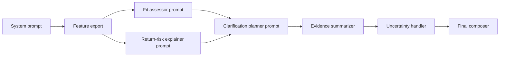

### Prompt roster

| Stage | Purpose | Inputs | Output schema | Grounding rules |
|-------|---------|--------|---------------|-----------------|
| System | Safety + tone | policy | n/a | No medical claims |
| Fit assessment | Narrate fit | feature JSON | `{bullets:[]}` | Must cite feature ids |
| Return-risk | Explain drivers | risk JSON | `{bullets:[]}` | No invented stats |
| Clarification planner | 0–3 questions | gaps | `{questions:[]}` | Must map `mapsToFeatureKeys` |
| Filter suggestion | Chips | catalog summary | `{chips:[]}` | Must be feasible |
| Evidence summarizer | Merge citations | evidence list | `{citations:[]}` | Deduplicate |
| Alternative recommendation | Tradeoffs | alt candidates | `{cards:[]}` | Explicit tradeoffs |
| Memory summarizer | User-facing prefs | memory | `{lines:[]}` | Opt-in language |
| Uncertainty handler | Hedge text | u metrics | `{hedge:string}` | No false certainty |
| Community summarizer | Neutral summary | claims | `{summary,badge}` | “Unverified” |

### Expected JSON schemas (illustration)

**Fit assessor**

```json
{
  "bullets": [
    { "text": "...", "featureIds": ["chart_fit_distance"], "confidence": 0.8 }
  ]
}
```

### Hallucination controls

- **Constrained decoding** to JSON schema where possible.
- **Numeric ban** in LLM: scores come from code only.
- **Citation requirement**: each bullet includes `featureIds` or `evidenceIds`.

### Turn logic

| Turn | Behavior |
|------|----------|
| First | If no gaps → BUY narrative; else CLARIFY |
| Clarification | Merge answers → rescore → shorten narrative |
| Refinement | Mention applied filters; update chips |
| Memory-aware | “Still true for you?” only if stale |
| Low-confidence | Add hedge + widen language; offer measurement |
| No-result | Suggest broaden filters + 1 clarifying question |

---

## 17. Frontend Experience

### Design principles (premium commerce)

- **Progressive disclosure**: show confidence first; questions only when needed.
- **Evidence-first**: explanations feel **grounded**, not marketing.
- **Non-alarmist risk**: risk is **information**, not fear copy.
- **Performance**: skeleton states; avoid layout shift.

### Component hierarchy

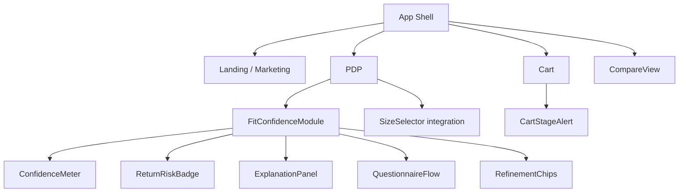

### Component inventory

| Component | Responsibility |
|-----------|----------------|
| **Landing page** | Merchant value, trust badges, demo PDP |
| **PDP fit module** | Orchestrates scoring + UI states |
| **Size selector** | Bi-directional binding with `recommendedVariantIds` |
| **Return-risk badge** | τ-based color + tooltip drivers |
| **Explanation panel** | Bullets + citations accordion |
| **Comparison view** | Shared scoring columns |
| **Alternative cards** | Tradeoffs + safer dimensions |
| **Confidence meter** | Continuous 0–1 with uncertainty band |
| **Questionnaire flow** | 0–3 steps, keyboard accessible |
| **Refinement chips** | Applies `filterPatch` + rerank |
| **Filter sidebar** | Merchant-defined + dynamic facets |
| **Memory controls** | View/forget prefs |
| **Community module** | Disclaimer + freshness |
| **Cart-stage alert** | Re-evaluate + swap CTA |

### Wireframe descriptions

#### PDP desktop (3-column feel)

- **Left**: gallery (unchanged).
- **Right stack**: title/price → **Fit confidence row** (meter + microcopy) → **Return-risk pill** → size selector with **“Recommended: US 9 Wide”** chip → ATC.
- **Below fold**: Explanation accordion (default **one** bullet visible).

#### PDP mobile

- Sticky bottom sheet: **Confidence + primary CTA**; “Details” expands explanation.

#### Compare mode

| Column | Row groups |
|--------|------------|
| Product A/B/C | Price, Fit, Risk, Key tradeoff, Stock |

### State machine (widget)

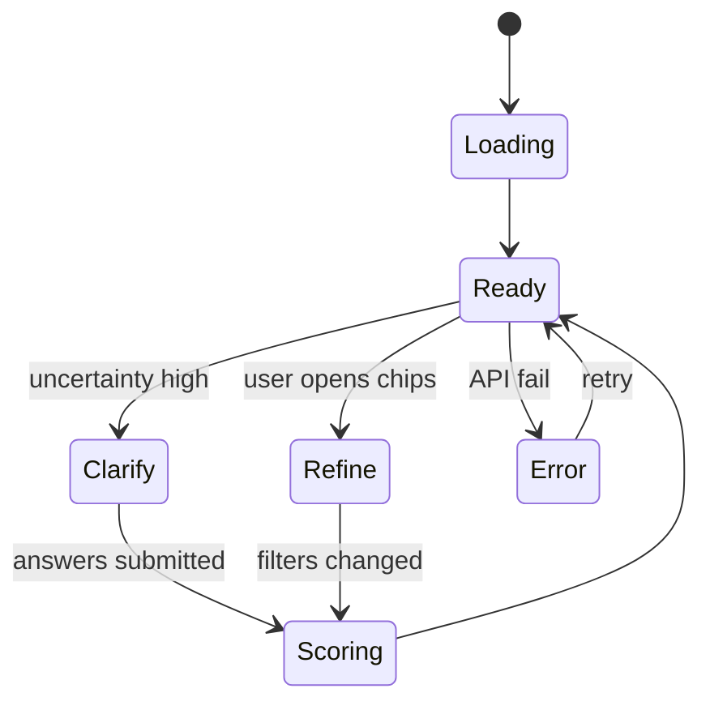

### Mobile vs desktop

| Aspect | Mobile | Desktop |
|--------|--------|---------|
| Questions | Full-screen stepper | Inline modal |
| Filters | Bottom sheet | Sidebar |
| Compare | Stacked cards | Table |

---

## 18. Design System and Visual Language

### Brand personality

- **Trusted specialist**: calm, precise, quietly premium.
- **Transparent**: surfaces uncertainty without drama.

### Visual principles

- **Clarity over decoration**; one primary accent.
- **Readable numerics** for scores (tab lining optional).

### Typography scale (rem)

| Token | Size | Use |
|-------|------|-----|
| `text-xs` | 0.75 | Meta, disclaimers |
| `text-sm` | 0.875 | Helper |
| `text-base` | 1 | Body |
| `text-lg` | 1.125 | Module titles |
| `text-xl` | 1.25 | Page subheads |

**Font pairing (recommended)**:
- Heading: **Fraunces** (character) or **Source Serif 4** (readable editorial).
- Body: **Source Sans 3** (clean UI).

### Spacing scale (px)

`4, 8, 12, 16, 20, 24, 32, 40, 48`

### Radius & shadow

| Token | Value |
|-------|-------|
| `radius-sm` | 8px |
| `radius-md` | 12px |
| `radius-lg` | 16px |
| `shadow-soft` | `0 8px 24px rgba(15, 23, 42, 0.08)` |

### Color palette (hex)

| Role | Hex | Notes |
|------|-----|-------|
| `ink` | `#0B1220` | Primary text |
| `muted` | `#5B6472` | Secondary text |
| `surface` | `#FFFFFF` | Cards |
| `canvas` | `#F6F7F9` | Page background |
| `line` | `#E6E8EC` | Hairlines |
| `accent` | `#1E5EFF` | Primary actions (not neon) |
| `accent-2` | `#0F766E` | Secondary emphasis |

### Semantic colors: confidence & risk

| State | Hex | Usage |
|-------|-----|-------|
| Confidence high | `#0F766E` | Meter fill top quartile |
| Confidence mid | `#B45309` | Mid band |
| Confidence low | `#9F1239` | Low band (not aggressive red) |
| Risk info | `#5B6472` | τ_info |
| Risk warn | `#B45309` | τ_warn |
| Risk strong | `#9F1239` | τ_soft_block (sparingly) |

### Icon system

- **Stroke** icons 1.5px; rounded caps.
- Metaphors: **ruler** (fit), **shield** (risk), **branch** (alternatives), **sliders** (refine).

### Motion

- **Duration**: 180–240ms for UI; **stagger** chips 40ms.
- **Easing**: `cubic-bezier(0.2, 0.8, 0.2, 1)` (smooth deceleration).
- Avoid **attention-grabbing** loops on risk states.

### Layout grid

- **12-column** grid, **72px** gutters desktop, **16px** mobile margins.

### Per-component visual language

| Component | Visual |
|-----------|--------|
| Confidence meter | Gradient fill + **uncertainty whiskers** |
| Risk badge | Pill + **info tooltip** with drivers |
| Alternatives | **Elevation 1** cards, tradeoff as **muted** line |
| Chips | `radius-pill`, subtle border `line` |
| Community | **Outlined** panel + “Unverified” chip |

### Premium, clear, non-alarmist copy patterns

- Prefer **“Higher than typical for this category”** over **“Dangerous choice.”**
- Pair risk with **action**: “Consider wide width” vs fear alone.

---

## 19. Testing Strategy and Test Cases

### Thirteen testing layers

1. **Unit** (pure functions: scoring, thresholds)
2. **Integration** (service + Postgres + Redis)
3. **E2E** (Playwright: widget happy path)
4. **Scoring** (golden vectors)
5. **Explanation grounding** (LLM output ↔ feature ids)
6. **Clarification** (policy: 0–3 questions)
7. **Memory** (decay + merge)
8. **Learning** (event → weight updates; offline)
9. **Filter** (rerank determinism)
10. **Community** (quality filters; optional off)
11. **Schema** (JSON Schema validation per endpoint)
12. **API contract** (consumer-driven contracts)
13. **Latency / load** (p95 budgets)

Additional quality gates:

14. **Regression** (model + rules snapshots)
15. **UI visual** (Chromatic / Percy)
16. **Accessibility** (axe)
17. **Responsive** (breakpoints)
18. **Calibration** (ECE monitors)

### Complete strategy table

| Layer | Tooling | Owner | Gate |
|-------|---------|-------|------|
| Unit | Jest | Eng | CI required |
| Integration | Jest + testcontainers | Eng | CI required |
| E2E | Playwright | Eng | nightly + pre-release |
| Schema | AJV | Eng | CI required |
| Contracts | Pact | Eng | CI optional |
| Visual | Storybook + snapshots | Design/Eng | weekly |
| A11y | axe-core | Eng | CI on critical paths |

### Sample fixtures

```json
{
  "fixture": "footwear_between_sizes",
  "userContext": { "measurements": { "foot_length_cm": 27.2 } },
  "productId": "prod_fixture_1",
  "expected": { "recommendedAction": "CLARIFY", "maxQuestions": 1 }
}
```

### Synthetic dataset strategy

- **Bootstrap**: 10k synthetic SKUs with controlled noise.
- **Label**: rule-based oracle for MVP; human audit 500 examples.
- **Stress**: long-tail sizes, sparse reviews.

### CI/CD plan


### Canary / rollback

- **Canary**: 5% traffic on new model artifact; watch **returnRisk calibration** + **error rate**.
- **Rollback**: promote previous artifact URI; feature flag off LLM layer.

### Forty+ concrete test cases

| ID | Layer | Description |
|----|-------|-------------|
| TC-001 | Unit | `fitConfidence` in [0,1] for all variants |
| TC-002 | Unit | `returnRisk` increases when SKU return rate increases |
| TC-003 | Unit | Threshold τ_warn triggers `recommendedAction` shift |
| TC-004 | Unit | Uncertainty combines epistemic/aleatoric monotonicity |
| TC-005 | Integration | `/v1/decision` returns `schemaVersion` |
| TC-006 | Integration | Invalid API key → 401 |
| TC-007 | Integration | Rate limit → 429 with `Retry-After` |
| TC-008 | Integration | Tenant isolation: cross-tenant productId → 404 |
| TC-009 | E2E | PDP widget renders meter within 2s p95 staging |
| TC-010 | E2E | Clarification step advances and rescores |
| TC-011 | Scoring | Golden vector `gv_shoe_01` matches ±1e-3 |
| TC-012 | Scoring | OOS variant never ranks #1 if policy enabled |
| TC-013 | Grounding | Every explanation bullet has `featureIds` |
| TC-014 | Grounding | LLM banned from inventing numeric rates |
| TC-015 | Clarify | 0 questions when `uncertainty.total < 0.25` and chart complete |
| TC-016 | Clarify | At most 3 questions enforced |
| TC-017 | Memory | Explicit width preference overrides inference |
| TC-018 | Memory | Decay reduces weight after TTL |
| TC-019 | Memory | User clears key → subsequent decision ignores |
| TC-020 | Filter | Applying `maxReturnRisk` excludes high-risk SKUs |
| TC-021 | Filter | Chip applies correct `filterPatch` |
| TC-022 | Community | Module hidden when `allowCommunityEnrichment=false` |
| TC-023 | Community | Low-quality threads filtered |
| TC-024 | Schema | `DecisionResponse` validates against JSON Schema |
| TC-025 | Contract | SDK types match OpenAPI |
| TC-026 | Latency | p95 `/decision` < 600ms without LLM |
| TC-027 | Latency | p95 with LLM < 1800ms (configurable) |
| TC-028 | Regression | Snapshot of feature export for fixture set |
| TC-029 | Visual | PDP module matches baseline screenshot |
| TC-030 | A11y | Questionnaire keyboard navigable |
| TC-031 | Responsive | Mobile bottom sheet does not trap focus |
| TC-032 | Calibration | ECE for `fitConfidence` < 0.05 on holdout |
| TC-033 | Unit | MMR diversification reduces near-duplicate alts |
| TC-034 | Integration | Webhook signature verification |
| TC-035 | E2E | Cart alert offers swap variant |
| TC-036 | Unit | `preventableReasonCodes` mapping stable |
| TC-037 | Grounding | Community summary includes disclaimer string |
| TC-038 | Clarify | Missing width triggers footwear question |
| TC-039 | Memory | Session anonymous → no PII persisted |
| TC-040 | Filter | Empty candidate set returns graceful `REFINE` |
| TC-041 | Integration | BullMQ job retries on transient PG errors |
| TC-042 | Latency | Redis cache hit reduces PG reads by >80% in sim |
| TC-043 | Schema | Behavior batch events validate individually |
| TC-044 | E2E | Compare view shows 3 products with scores |

---

## 20. Metrics and Evaluation

### Offline metrics (15)

1. **Size recommendation accuracy@1** (within tolerance)
2. **Size accuracy@3**
3. **Fit confidence ECE** (calibration)
4. **Brier score** for fit
5. **Return-risk ECE**
6. **AUC-ROC** for preventable return proxy
7. **PR-AUC** under imbalance
8. **NDCG@k** for alternatives
9. **Coverage** (fraction with any recommendation)
10. **Abstention rate** (when allowed)
11. **Explanation grounding rate** (% bullets w/ valid ids)
12. **Contradiction rate** (LLM vs code scores)
13. **Per-category error**
14. **Cold-start bucket performance**
15. **Latency sensitivity** (feature ablation)

### Online metrics (18)

1. **Widget engagement rate**
2. **Question completion rate**
3. **ATC rate** (widget exposed)
4. **Conversion rate**
5. **Return rate** (integrated merchants)
6. **Exchange rate**
7. **Average order value**
8. **Time-to-decision** (PDP)
9. **Clarification→purchase lift**
10. **Alternative acceptance rate**
11. **Filter chip usage**
12. **Memory opt-in rate**
13. **Community module expand rate**
14. **CS tickets** mentioning sizing (proxy)
15. **Merchant ROI estimate** (returns $ avoided)
16. **API error rate**
17. **p95 latency**
18. **Churn** (merchant)

### Gold dataset & annotation rubric

| Field | Guidance |
|-------|----------|
| **True size** | Expert label with brand chart |
| **Acceptable range** | If two sizes defensible → label set |
| **Preventable return** | RMS reason mapped |

### A/B test design

- **Unit**: session-level randomization; **stable** variant per user.
- **Guardrails**: return rate must not regress beyond **+X bps** without review.

### Failure analysis taxonomy

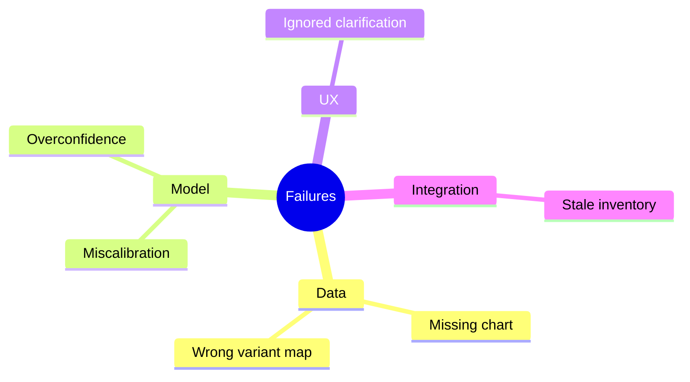

---

## 21. Security, Reliability, and Guardrails

### Tenant isolation

- **Row-level security** in Postgres by `tenant_id`.
- **API keys** scoped; publishable keys **cannot** read admin.

### Auth

- **mTLS** optional for enterprise; **JWT** for user endpoints.

### PII minimization

- Store **hashed email** only if needed; prefer **opaque user id**.

### Prompt injection defenses

- **Structured inputs**; feature JSON from code only.
- **System policy**: ignore instructions in user measurements.

### Abuse prevention

- **Rate limits**, **CAPTCHA** on public endpoints if abused.
- **Anomaly detection** on behavior spam.

### Schema validation

- **Reject** unknown fields if strict mode; version schemas.

### Observability

- **OpenTelemetry** traces: gateway → orchestrator → engines.
- **Metrics**: latency histograms, error budgets.

### Retries & timeouts

| Call | Timeout | Retries |
|------|---------|---------|
| LLM explain | 1500ms | 1 |
| DB | 200ms pool | 2 jittered |
| Redis | 50ms | 1 |

### Caching

- **Product graph** cached per `tenantId+productId` (TTL 300s).
- **LLM**: cache explanation **keyed by feature hash** (short TTL).

### Graceful degradation

- LLM down → **template** explanations from features.
- Reviews missing → drop NLP features.

### Product guardrails

| Risk | Mitigation |
|------|------------|
| Health claims (beauty) | Disallow treatment language; patch-test reminders |
| Regulated products | Category blocks |
| Deceptive certainty | `uncertainty` drives copy |
| Manipulative upsells | Alternatives must score **better on risk/fit**, not just price |
| Biased recommendations | Fairness audits on demographics proxies |
| Invasive memory | Explicit controls; clear data map |

---

## 22. MVP Roadmap

### 48-hour prototype

| Scope | Tasks | Dependencies | Demo milestone | Success | Deferrals |
|-------|-------|--------------|----------------|---------|-----------|
| Static JSON API | Mock `DecisionResponse` | None | Postman works | Shapes stable | Real data |
| Minimal widget | Meter + static text | API | Staging PDP | Renders | Clarification |

### 2-week prototype

| Scope | Tasks | Dependencies | Demo | Success | Deferrals |
|-------|-------|--------------|--------|---------|-----------|
| Rules engine | Footwear scoring | Catalog | Live scores | MAE vs rules oracle | ML |
| LLM explain | Grounded template | Feature export | Narrative | Grounding ≥95% | Community |

### 6-week MVP

| Scope | Tasks | Dependencies | Demo | Success | Deferrals |
|-------|-------|--------------|--------|---------|-----------|
| NestJS services | Decision pipeline | Postgres/Redis | End-to-end | p95 latency target | Multi-tenant SSO |
| Widget | Full module | Design system | Merchant trial | Engagement | Magento adapter |
| Admin | Keys + thresholds | Auth | Configure τ | Works | Advanced analytics |

### 12-week production plan

| Scope | Tasks | Dependencies | Demo | Success | Deferrals |
|-------|-------|--------------|--------|---------|-----------|
| Calibrated models | Offline training | Gold labels | Metrics dashboard | ECE thresholds | Global models |
| Shopify adapter | OAuth + sync | Platform | Live merchant | Orders | BigCommerce |
| Community | Ingestion + UI | Legal review | Module | Quality | Deep crawl |

### Two-engineer staffing

- **Build first**: orchestrator + scoring + widget + Postgres schema.
- **Cut**: community, multi-region, advanced LTR.

### Mandatory vs deferrable

| Mandatory | Deferrable |
|-----------|------------|
| `DecisionResponse` + validation | Community ingestion |
| Footwear OR apparel vertical | Both verticals day 1 |
| API + widget | Full marketplace adapters |
| Basic admin | Full BI suite |

---

## 23. Codebase / Monorepo Scaffold

### Stack justification

- **Next.js + TypeScript**: premium merchant dashboards, SSR, React ecosystem.
- **NestJS**: structured modules for **gateway-friendly** services, DI, OpenAPI.
- **Postgres**: relational catalog + memory; **pgvector** for similarity.
- **Redis**: session, cache, rate limits.
- **BullMQ**: async ingestion (reviews/returns), enrichment.

### Full file tree

```
.
├── apps
│   ├── web                 # Next.js merchant dashboard + marketing
│   ├── widget              # Embeddable package (bundled)
│   └── docs-site           # optional later
├── packages
│   ├── sdk                 # @rpfit/sdk
│   ├── types               # shared TS types + zod/json-schema
│   ├── ui                  # shared React components
│   └── config              # eslint/tsconfig
├── services
│   ├── api-gateway         # or consolidated in api service
│   └── decision-api        # NestJS: orchestration + endpoints
├── workers
│   ├── ingest-catalog
│   ├── ingest-reviews
│   └── train-export        # offline jobs
├── infra
│   ├── docker-compose.yml
│   ├── k8s/                # helm charts (later)
│   └── terraform/          # later
├── ml
│   ├── notebooks
│   └── artifacts/README.md
├── README.md
└── pnpm-workspace.yaml
```

### Representative starter files

```
services/decision-api/src/main.ts
services/decision-api/src/app.module.ts
services/decision-api/src/decision/decision.controller.ts
services/decision-api/src/decision/decision.service.ts
services/decision-api/src/fit/fit.service.ts
services/decision-api/src/risk/return-risk.service.ts
services/decision-api/src/memory/memory.service.ts
services/decision-api/src/llm/explain.service.ts
packages/types/src/decision.ts
packages/types/src/catalog.ts
apps/web/app/(dashboard)/settings/widget/page.tsx
workers/ingest-catalog/src/processor.ts
```

### `docker-compose` services (dev)

- `postgres` (with `pgvector`)
- `redis`
- `api`
- `worker`

---

## 24. Example Flows

Each example includes **user input**, **product context**, **parsed uncertainty**, **clarification decision**, **fit confidence**, **return-risk**, **refinements**, **recommendation**, **explanation**, **alternatives**, **memory update**, **community feedback** (optional).

### 1) Running shoe — between sizes

| Field | Value |
|-------|-------|
| **User input** | “Usually US 9 Nike; this model feels tight in 9.” |
| **Product context** | Neutral cushion trainer; sizes 8–13; **half sizes** available. |
| **Parsed uncertainty** | `epistemic=0.25`, `aleatoric=0.35` (comfort subjective); brand curve conflict. |
| **Clarification** | 1 question: “Do you prioritize **toe room** or **locked-in heel**?” → toe room. |
| **Fit confidence** | 0.72 for **9.5**; 0.61 for **9** |
| **Return-risk** | 0.48 for **9** (reviews: narrow toe); 0.33 for **9.5** |
| **Refinements** | Chips: “Wide available”, “Plush cushion” |
| **Recommendation** | `recommendedVariantIds: ["var_9_5"]`, action `BUY` |
| **Explanation** | Bullets tie to `review_narrow_toe` + **half-size** availability. |
| **Alternatives** | Wider upper model in `alternatives[]` with tradeoff “more weight”. |
| **Memory update** | `footwear.halfSizePreference=UP` (inferred, medium confidence) |
| **Community** | Threads mention break-in; summarized as **unverified** |

### 2) Standing-all-day work shoe

| Field | Value |
|-------|-------|
| **User input** | “I stand 9 hours; concrete floors; wide feet.” |
| **Product context** | Service shoe; slip-resistant; widths **M/W/XW**. |
| **Parsed uncertainty** | Missing **width** measurement; high `epistemic`. |
| **Clarification** | 2 questions: width + arch pain? |
| **Fit confidence** | 0.78 after answers |
| **Return-risk** | 0.29 |
| **Refinements** | Chip: “Shock absorbing insole” |
| **Recommendation** | `W` width variant |
| **Explanation** | Links **use case** feature + **wide** match |
| **Alternatives** | Softer midsole competitor; tradeoff durability |
| **Memory** | `footwear.widthPreference=WIDE` explicit |
| **Community** | n/a optional |

### 3) Slim-fit jacket

| Field | Value |
|-------|-------|
| **User input** | Chest 40in; prefers layering; slim fit anxiety |
| **Product context** | Slim cut; **stretch wool** |
| **Parsed uncertainty** | Chart overlap **M vs L** |
| **Clarification** | “Layering under?” → yes → pick **L** |
| **Fit confidence** | 0.69 |
| **Return-risk** | 0.52 (slim cut + layering mismatch risk) |
| **Refinements** | “Classic fit” sister SKU |
| **Recommendation** | `L` if layering; else `M` |
| **Explanation** | Stretch reduces `SIZE_TOO_SMALL` driver |
| **Alternatives** | Classic fit productId |
| **Memory** | `apparel.layering=true` |
| **Community** | “Runs slim” mentions aggregated |

### 4) Sofa — small apartment

| Field | Value |
|-------|-------|
| **User input** | 74" max wall; needs 32" doorway |
| **Product context** | Modular sofa; **box dimensions** listed |
| **Parsed uncertainty** | Spatial feasibility vs comfort tradeoff |
| **Clarification** | “Elevator/stairwell constraints?” |
| **Fit confidence** | 0.81 on **fits space** |
| **Return-risk** | 0.41 (bulky return cost) |
| **Refinements** | Filter depth ≤ 38" |
| **Recommendation** | Configuration **A** |
| **Explanation** | Doorway clearance math shown |
| **Alternatives** | Smaller module variant |
| **Memory** | `home.maxSectionalWidthIn=74` |
| **Community** | Delivery anecdotes (secondary) |

### 5) Easy-to-clean dining chair

| Field | Value |
|-------|-------|
| **User input** | Kids + spills; light upholstery worry |
| **Product context** | Performance fabric; **cleanability code** |
| **Parsed uncertainty** | Subjective “easy” |
| **Clarification** | 1 question: “Dark vs light room?” |
| **Fit confidence** | 0.66 |
| **Return-risk** | 0.44 (color expectation) |
| **Refinements** | Chip: “Dark colorway” |
| **Recommendation** | Charcoal variant |
| **Explanation** | Fabric signal + stain resistance attrs |
| **Alternatives** | Molded plastic chair lower risk, lower comfort |
| **Memory** | `home.kids=true` |
| **Community** | Stain anecdotes |

### 6) Carry-on — business travel

| Field | Value |
|-------|-------|
| **User input** | Mostly **EU short-haul**; laptop 15" |
| **Product context** | Carry-on listed **55x40x20 cm** airline compliance |
| **Parsed uncertainty** | Airline variability |
| **Clarification** | “Primary airline?” |
| **Fit confidence** | 0.73 |
| **Return-risk** | 0.37 |
| **Refinements** | Filter: **international** common sizes |
| **Recommendation** | Variant with **compression** |
| **Explanation** | Constraint fit to stated airline distribution |
| **Alternatives** | Softer bag if overhead tight |
| **Memory** | `travel.primaryRegion=EU` |
| **Community** | Gate-check stories downweighted |

### 7) Skincare — sensitive skin

| Field | Value |
|-------|-------|
| **User input** | Sensitive; rosacea prone |
| **Product context** | Serum with actives |
| **Parsed uncertainty** | Medical-adjacent risk |
| **Clarification** | “Patch test ok?” + **disclaimer** |
| **Fit confidence** | mapped to **tolerance likelihood** proxy 0.58 |
| **Return-risk** | 0.46 (irritation returns) |
| **Refinements** | “Fragrance-free” chip |
| **Recommendation** | Lower active variant if exists |
| **Explanation** | Grounded ingredient attrs; **no medical claims** |
| **Alternatives** | Gentler brand alternative |
| **Memory** | `beauty.sensitivity=HIGH` explicit |
| **Community** | Mixed reactions; high variance flagged |

### 8) Vacuum — pet hair

| Field | Value |
|-------|-------|
| **User input** | Pet hair + hardwood |
| **Product context** | Brush roll specs; filtration |
| **Parsed uncertainty** | Performance vs marketing |
| **Clarification** | “Rugs present?” |
| **Fit confidence** | 0.71 on **pickup** intent |
| **Return-risk** | 0.35 |
| **Refinements** | “Tangle-free brush” |
| **Recommendation** | Pet variant SKU |
| **Explanation** | Review phrases mapped to `PET_HAIR` performance |
| **Alternatives** | Lighter stick; tradeoff bin size |
| **Memory** | `home.pets=true` |
| **Community** | Pet owner threads summarized |

### 9) Baby gift

| Field | Value |
|-------|-------|
| **User input** | Baby shower; unknown nursery theme |
| **Product context** | Neutral SKU set |
| **Parsed uncertainty** | High **aleatoric** (recipient taste) |
| **Clarification** | 1 question: “Prefer practical vs sentimental?” |
| **Fit confidence** | 0.62 |
| **Return-risk** | 0.55 (gift mismatch) |
| **Refinements** | “Return-friendly merchant policy” (merchant meta) |
| **Recommendation** | Neutral bundle |
| **Explanation** | Honest uncertainty; gift guidance |
| **Alternatives** | Gift card alternative (if merchant allows) |
| **Memory** | none |
| **Community** | Parent forum tips (weak) |

### 10) Wedding guest outfit

| Field | Value |
|-------|-------|
| **User input** | Outdoor summer wedding; dress code ambiguous |
| **Product context** | Apparel catalog |
| **Parsed uncertainty** | Dress code ambiguity |
| **Clarification** | “Ceremony formality?” |
| **Fit confidence** | 0.64 |
| **Return-risk** | 0.49 (expectation mismatch) |
| **Refinements** | “Breathable fabric”, “lighter colors” |
| **Recommendation** | Variant aligned to **semi-formal** |
| **Explanation** | Use-case alignment; not fashion absolutes |
| **Alternatives** | Safer conservative option |
| **Memory** | `style.formalityPreference` |
| **Community** | Seasonal outfit threads |

### 11) Ergonomic desk chair

| Field | Value |
|-------|-------|
| **User input** | Lower back pain; 5'10"; long work sessions |
| **Product context** | Lumbar adjust; seat depth |
| **Parsed uncertainty** | Ergonomic subjective fit |
| **Clarification** | “Forward tilt needed?” |
| **Fit confidence** | 0.67 |
| **Return-risk** | 0.42 |
| **Refinements** | “Seat depth adjust” |
| **Recommendation** | Size **B** analog |
| **Explanation** | Maps measurements to ranges |
| **Alternatives** | Headrest add-on model |
| **Memory** | `ergo.lumbarPriority=HIGH` |
| **Community** | Long-session comfort variance |

### 12) Suitcase — overhead bin

| Field | Value |
|-------|-------|
| **User input** | US domestic; must fit **regional jets** sometimes |
| **Product context** | Hardside listed dimensions |
| **Parsed uncertainty** | strictest airline bin |
| **Clarification** | “Do you fly regional often?” → yes |
| **Fit confidence** | 0.7 |
| **Return-risk** | 0.4 (gate check risk) |
| **Refinements** | “Underseat companion” |
| **Recommendation** | Smaller hardside |
| **Explanation** | Conservative bin assumption |
| **Alternatives** | Softside expandable |
| **Memory** | `travel.regionalJetRisk=HIGH` |
| **Community** | Airline-specific threads |

---

## 25. Risks and Open Questions

| ID | Risk | Why it matters | Early warning signals | Mitigation |
|----|------|----------------|----------------------|------------|
| R1 | Bad catalog mappings | Wrong variant → wrong decision | Spike in exchanges | Quarantine + mapping tests |
| R2 | Overconfident model | Trust erosion | ECE drift | Calibration + uncertainty |
| R3 | LLM hallucination | Legal/trust | Grounding failures↑ | Schema + feature-only narrative |
| R4 | Review spam | Skewed NLP | Anomaly spikes | Robust stats + downweight |
| R5 | Return data bias | Wrong priors | Category drift | Separate buckets |
| R6 | Privacy concerns | Churn | Consent complaints | Minimize PII + controls |
| R7 | Prompt injection | Abuse | Strange outputs | Structured inputs |
| R8 | Marketplace heterogeneity | Weak fits | Seller variance | Per-seller thresholds |
| R9 | Community misinfo | Wrong social proof | Contradiction variance | Labels + sample size |
| R10 | Latency budget | Abandonment | p95↑ | Cache + optional LLM |
| R11 | Regulatory (beauty/health) | Compliance | Legal flags | Category policies |
| R12 | Fairness (sizeism) | Reputation harm | Demographic disparities | Audits |
| R13 | Merchant distrust of AI | Adoption | Low usage | Transparent scores |
| R14 | Cold start new SKUs | Weak accuracy | High epistemic | Borrow brand signals |
| R15 | Ops burden integrations | Support load | Failed syncs | Monitoring + retries |
| R16 | Incentive misalignment (upsell) | Bad PR | AOV↑ with returns↑ | Constrain alt scoring |

### Open questions

1. Merchant **legal** stance on community ingestion per brand.
2. **Exchange** data availability vs privacy.
3. **International** sizing normalization ownership.
4. **Final sale** SKUs: hard block vs warn?

---

## 26. Final Recommendation

### Recommended MVP architecture

- **NestJS `decision-api`** + **Postgres/pgvector** + **Redis** + **BullMQ workers** for ingestion.
- **Next.js** merchant dashboard for keys, thresholds, widget theme.
- **Rules + features + calibration hooks** now; **learned models** as drop-in artifacts.

### Best business model

- **Tiered SaaS** by SKU/GMV with **Growth** tier including hosted widget + review ingestion.

### Fastest path to market / demo

- **2-week prototype** path in §22: footwear slice + grounded explanations + staging widget.

### Build first

1. Canonical types + `/v1/decision`.
2. Footwear scoring + clarification planner.
3. Widget (meter + risk + explain).
4. Admin: keys + τ thresholds.

### Postpone

- Community Reddit ingestion beyond stub.
- Multi-marketplace adapters beyond one.

### Biggest risks

- **Data quality** > model sophistication.
- **Overclaiming** in copy → trust loss.
- **Latency** if LLM on critical path without cache.

### Recommended next step

Ship a **single-merchant pilot** on **Shopify staging** with **review optional**, **returns optional**, instrument **TC-001–TC-020** metrics weekly, and iterate **thresholds** before model complexity.

---

### Appendix A — OpenAPI fragment (`POST /v1/decision`)

```yaml
paths:
  /v1/decision:
    post:
      summary: Compute decision response
      requestBody:
        required: true
        content:
          application/json:
            schema:
              $ref: '#/components/schemas/DecisionRequest'
      responses:
        '200':
          description: OK
          content:
            application/json:
              schema:
                $ref: '#/components/schemas/DecisionResponse'
```

### Appendix B — JSON Schema idempotency

```http
POST /v1/decision HTTP/1.1
Idempotency-Key: 7f2c3b2a-4d2a-4c1a-9f0a-aaaaaaaaaaaa
```

### Appendix C — Orchestrator pseudo-code (full path)

```pseudo
function handleDecision(req: DecisionRequest): DecisionResponse {
  assertTenant(req.tenantId)
  product = catalog.get(req.tenantId, req.productId)
  variants = resolveVariants(product, req.candidateVariantIds)
  mem = memory.get(req.tenantId, req.userId, product.categoryId)
  signals = signalStore.assemble(req.tenantId, product, variants)
  userCtx = merge(req.userContext, mem)

  scored = []
  for v in variants:
    fv = features.build(product, v, userCtx, signals)
    fc = fit.score(fv)
    rr = risk.score(fv)
    u = uncertainty.estimate(fv, signals)
    scored.push({ v, fv, fc, rr, u })

  best = pickPrimary(scored, policy=tenantPolicy(req.tenantId))
  action = policy.chooseAction(best.fc, best.rr, best.u.total, product.categoryId)

  questions = []
  if action == CLARIFY:
    questions = clarify.plan(gaps=featureGaps(best.fv), max=3, category=product.categoryId)

  alts = []
  if action in [CONSIDER_ALTERNATIVE, CLARIFY] or best.rr > tauWarn(req.tenantId):
    alts = alternatives.rank(product, scored, catalog.neighbors(product.id), userCtx)

  explanation = explain.compose(
    template=selectTemplate(action),
    features=exportForLLM(best.fv),
    evidence=signals.evidenceRefs,
    community=signals.communityOptional
  )

  memoryDeltas = memory.diff(mem, userCtx, best.v)

  return DecisionResponse.new({
    action, best, questions, alts, explanation, memoryDeltas
  })
}
```

### Appendix D — `POST /v1/behavior` batch envelope

```json
{
  "tenantId": "t_1",
  "sessionId": "s_abc",
  "userId": "usr_77",
  "events": [
    { "type": "PDP_VIEW", "payload": { "productId": "prod_501" }, "ts": "2026-03-30T12:00:01Z" },
    { "type": "SIZE_TOGGLE", "payload": { "from": "var_1", "to": "var_2" }, "ts": "2026-03-30T12:00:05Z" }
  ]
}
```

### Appendix E — Feature flag matrix

| Flag | Default | Purpose |
|------|---------|---------|
| `llm_explanations_enabled` | on | Disable → template strings |
| `community_module_enabled` | off | Legal/compliance |
| `risk_soft_block_enabled` | off | Merchant choice |
| `cache_product_graph` | on | Latency |

### Appendix F — PDP embed contract (merchant)

```typescript
export interface WidgetBootstrap {
  tenantId: string;
  publishableKey: string;
  productId: string;
  locale: string;
  sessionId: string;
  userId?: string;
}
```

### Appendix G — Additional Mermaid: data flow for learning

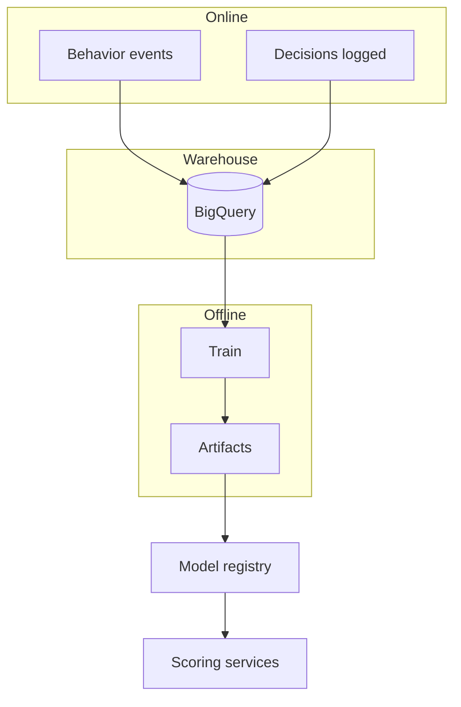

### Appendix H — Expanded category feature tables

#### Apparel (tops)

| Feature key | Description | Range |
|-------------|-------------|-------|
| `chest_delta_in` | User chest minus chart mid | ℝ |
| `stretch_factor` | Fabric elastane % mapped | 0–1 |
| `fit_style_bias` | slim/regular/relaxed preference | one-hot |

#### Footwear

| Feature key | Description | Range |
|-------------|-------------|-------|
| `foot_length_delta` | vs brand size curve | ℝ |
| `width_code_match` | exact/near/miss | 0–1 |
| `use_case_standing_hours` | stated hours | 0–12 |

#### Furniture

| Feature key | Description | Range |
|-------------|-------------|-------|
| `clearance_margin_in` | min(door, hallway) − item | ℝ |
| `modular_flex` | reconfig options | 0–1 |

#### Beauty

| Feature key | Description | Range |
|-------------|-------------|-------|
| `active_potency` | retinol % tier | ordinal |
| `fragrance_flag` | present | 0/1 |

#### Travel gear

| Feature key | Description | Range |
|-------------|-------------|-------|
| `bin_fit_score` | vs strictest airline in profile | 0–1 |
| `weight_penalty_kg` | carry burden | ℝ |

#### Home goods (vacuum)

| Feature key | Description | Range |
|-------------|-------------|-------|
| `pet_hair_lift_proxy` | NLP+spec composite | 0–1 |
| `hard_floor_bias` | user home mix | 0–1 |

### Appendix I — Decision matrix (extended)

| fitConfidence | returnRisk | uncertainty | Policy hint |
|---------------|------------|-------------|-------------|
| ≥0.8 | ≤0.35 | low | Strong BUY |
| ≥0.8 | >0.55 | low | BUY + alt row |
| 0.6–0.8 | ≤0.45 | mid | BUY + tradeoff |
| 0.6–0.8 | >0.55 | mid | CLARIFY 1–2 |
| <0.6 | any | high | CLARIFY or REFINE |
| any | >0.72 | any | CONSIDER_ALTERNATIVE default |

### Appendix J — Webhook payload example

```json
{
  "type": "decision.logged",
  "tenantId": "t_1",
  "requestId": "req_123",
  "productId": "prod_501",
  "recommendedAction": "BUY",
  "fitConfidence": 0.74,
  "returnRisk": 0.41
}
```

### Appendix K — Rate limit headers

```http
X-RateLimit-Limit: 600
X-RateLimit-Remaining: 124
X-RateLimit-Reset: 1711800000
```

### Appendix L — SQL sketch: tenant-scoped product fetch

```sql
SELECT p.*, v.*
FROM products p
JOIN variants v ON v.product_id = p.id
WHERE p.tenant_id = $1 AND p.id = $2 AND p.status = 'ACTIVE';
```

### Appendix M — Redis keys convention

| Key | TTL | Purpose |
|-----|-----|---------|
| `pg:{tenant}:{productId}` | 300s | Product graph cache |
| `rl:{apiKeyId}:{minute}` | 70s | Rate limiting |
| `idem:{idempotencyKey}` | 24h | Idempotent replays |

### Appendix N — BullMQ queues

| Queue | Job | Priority |
|-------|-----|----------|
| `ingest.catalog` | Sync SKU | normal |
| `ingest.reviews` | Pull reviews | low |
| `train.export` | Export features | low |

### Appendix O — Additional test cases (TC-045–TC-060)

| ID | Description |
|----|-------------|
| TC-045 | Feature export stable ordering for hashing |
| TC-046 | pgvector similarity returns k=20 in <50ms |
| TC-047 | Widget publishable key cannot call admin |
| TC-048 | `softBlock` never triggers when merchant disables |
| TC-049 | Clarification mapping always nonempty `mapsToFeatureKeys` |
| TC-050 | Return of banned category blocks purchase suggestion (policy) |
| TC-051 | Multi-currency money parsing correct for 3-letter ISO |
| TC-052 | Size chart unit conversion inch↔cm exact on fixtures |
| TC-053 | Mismatch cost raises question cap for furniture |
| TC-054 | Session memory does not leak across tenants |
| TC-055 | Webhook retries exponential backoff |
| TC-056 | LLM timeout falls back to template |
| TC-057 | Community claims capped at N per render |
| TC-058 | Compare mode handles 4th product gracefully (drops or scroll) |
| TC-059 | Analytics event batching respects size limit |
| TC-060 | OAuth token refresh for Shopify connector |

### Appendix P — Offline metric definitions (formal)

- **ECE**: \(\sum_b \frac{|B_b|}{n} |\text{acc}(B_b) - \text{conf}(B_b)|\) across bins \(B_b\).
- **NDCG@k**: standard; gains from graded relevance of alternatives.

### Appendix Q — Online guardrail SLOs

| SLO | Target |
|-----|--------|
| API availability | 99.9% monthly |
| p95 `/v1/decision` | < 1.2s with LLM |
| Error rate | < 0.5% |

### Appendix R — Merchant dashboard routes (suggested)

| Route | Purpose |
|-------|---------|
| `/settings/api-keys` | Rotate keys |
| `/settings/widget` | Theme |
| `/settings/thresholds` | τ tuning |
| `/data/feeds` | Catalog status |
| `/analytics/overview` | KPI tiles |

### Appendix S — Glossary

| Term | Definition |
|------|------------|
| **τ** | Threshold family for risk bands |
| **MMR** | Maximal Marginal Relevance diversification |
| **ECE** | Expected Calibration Error |
| **OMS** | Order Management System |
| **PIM** | Product Information Management |

### Appendix T — Threat model (abbrev.)

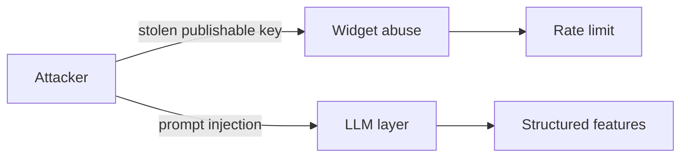

### Appendix U — Additional JSON: `DecisionRequest` minimal

```json
{
  "schemaVersion": "1.0.0",
  "tenantId": "t_1",
  "sessionId": "s_abc",
  "productId": "prod_501",
  "userContext": {},
  "mode": "PDP"
}
```

### Appendix V — Additional JSON: `DecisionResponse` minimal

```json
{
  "schemaVersion": "1.0.0",
  "requestId": "req_123",
  "tenantId": "t_1",
  "productId": "prod_501",
  "resolvedVariantIds": ["var_9001"],
  "recommendedVariantIds": ["var_9001"],
  "recommendedAction": "BUY",
  "fitConfidence": 0.74,
  "returnRisk": 0.41,
  "uncertainty": { "epistemic": 0.2, "aleatoric": 0.18, "total": 0.27 },
  "alternatives": [],
  "explanation": {
    "summary": "Likely match based on chart and reviews.",
    "bullets": [{ "text": "...", "featureIds": ["chart_fit_distance"] }],
    "citations": []
  }
}
```

### Appendix W — NestJS module map

```text
AppModule
├── DecisionModule
├── FitModule
├── RiskModule
├── MemoryModule
├── CatalogModule
├── LlmModule
├── AuthModule
└── HealthModule
```

### Appendix X — pgvector index notes

- Use **IVFFLAT** or **HNSW** depending on Postgres version; **analyze** after bulk load.

### Appendix Y — CI matrix (example)

| Job | Trigger |
|-----|---------|
| `lint` | every PR |
| `test-unit` | every PR |
| `test-integration` | every PR to main |
| `e2e` | nightly |

### Appendix Z — Versioning policy for `schemaVersion`

- **Patch**: copy fixes, non-breaking.
- **Minor**: new optional fields.
- **Major**: breaking shape → `/v2`.

### Appendix AA — Zod-style validation sketch (TypeScript)

```typescript
import { z } from 'zod';

export const DecisionRequestSchema = z.object({
  schemaVersion: z.literal('1.0.0'),
  tenantId: z.string().min(1),
  sessionId: z.string().min(1),
  userId: z.string().optional(),
  productId: z.string().min(1),
  candidateVariantIds: z.array(z.string()).optional(),
  userContext: z.record(z.unknown()),
  filterState: z.record(z.unknown()).optional(),
  mode: z.enum(['PDP', 'CART', 'COMPARE', 'SEARCH'])
});
```

### Appendix AB — Monitoring alerts (examples)

| Alert | Condition | Page |
|-------|-----------|------|
| Latency SLO | p95 > 1.8s for 10m | Orchestrator |
| Error spike | 5xx > 2% for 5m | Gateway |
| Calibration drift | ECE↑ week-over-week | ML |

### Appendix AC — Accessibility checklist (widget)

1. Focus trap only inside modal sheets; ESC closes.
2. Meter has **textual** equivalent (`aria-valuenow`).
3. Risk badge includes **readable** label, not color alone.

---

**End of document.**
